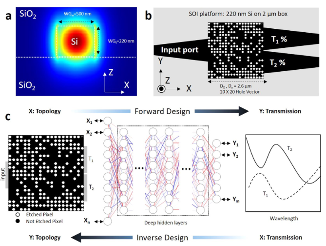
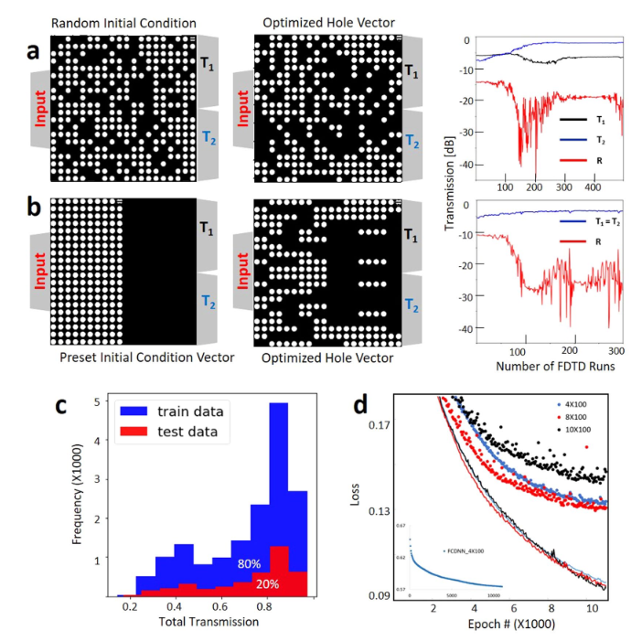

# 集成光子功率分配器的深度神经网络逆设计
Mohammad H. tahersima ,  Keisuke Kojima ,  toshiaki Koike-Akino, Devesh Jha  , Bingnan Wang, Chungwei Lin & Kieran parsons
 Received: 24 September 2018  
 Accepted: 13 December 2018  
 Published online:February 2019

## 摘要

对于科学和工程应用而言，预测人造结构材料的物理响应尤为重要。在这里，我们使用深度学习来预测人工设计的纳米光子设备的光学响应。除了预测任何给定拓扑的传输响应的前向近似之外，这种方法还允许我们对目标光学响应进行反向近似设计。我们的深度神经网络（DNN）可以设计紧凑型（2.6×2.6μm2）绝缘体上硅（SOI）的1×2功率分配器，并在不到一秒钟的时间内实现各种目标分配比。该模型经过训练，可将反射最小化（小于〜−20 dB），同时实现高于90％的最大传输效率和目标分割规格。这种方法为依靠复杂的纳米结构快速设计集成光子组件铺平了道路。

 

## 1.引言
人工设计的亚波长纳米结构材料可用于控制入射电磁波进入特定的透射和反射波阵面。最近的纳米光子器件已经使用了这种复杂的结构，从而以紧凑且节能的形式在光学，集成光子学，传感和计算元材料中实现了新的应用。然而，使用数值模拟来优化具有大量可能的特征组合的纳米结构在计算上是昂贵的。例如，根据光子设备的体积，通过有限差分时域（FDTD）方法计算电磁场轮廓可能需要很长的仿真时间（几分钟到几小时），以分析光传输响应。为了设计实现目标透射曲线的纳米结构，我们需要在大多数元启发式方法中执行大量的FDTD仿真。为了解决该问题，我们之前开发了一种使用神经网络（NN）的人工智能集成优化过程，该过程可以通过减少所需的数值模拟次数来证明神经网络如何帮助简化设计过程，从而加快优化速度  
 

深度学习方法是通过非线性模型的组合而获得的表示学习技术，这些非线性模型以分层的方式将先前级别的表示转换为更高且稍微抽象的级别。主要思想是，通过级联大量此类转换，可以使用深度神经网络以数据驱动的方式学习非常复杂的功能。深度学习在建模复杂的投入产出关系方面的巨大成功吸引了一些科学界的关注，例如材料发现，高能物理学，单分子成像医学诊断和粒子物理学。它在光学界引起了一定的关注，最近有一些关于使用DNN设计纳米结构光学组件的逆向建模以及人工神经网络的硬件实现的反向工作。 NN可以用于预测拓扑的光学响应（正向设计），也可以用于设计目标光学响应的​​拓扑（逆向设计）。

光子结构的逆设计通常通过伴随灵敏度分析来证明。最近，D。Liu使用串联神经网络架构来学习厚度变化的交替电介质薄膜的非唯一电磁散射。 J. Peurifoy证明了神经网络使用深度为4层的完全连接的神经网络来近似SiO2和TiO2多层壳纳米粒子的光散射。在本文准备期间，浅野信华（T. Asano）提供了一个神经网络，用于预测二维光子晶体中的品质因数。受到这一进展的启发，我们的目标是训练一种神经网络，该网络可以按用户指定的比率即时设计集成光子功率分配器。集成光子设备的设计空间比以前演示的光散射应用程序大得多，后者需要强大的更深层次的网络，例如Deep Residual Networks（ResNet）

基于多模干扰（MMI）的集成光子分束器已被广泛用于将功率平均分配到输出端口。尽管可以将任意的分光比应用于各种应用，例如信号监控，反馈电路或光学量化36，但由于设计复杂性，几乎无法探索设计空间。田等(Tian et al)演示了在15×15μm2的器件尺寸中具有可变分光比的基于SOI的耦合器，带宽为60 nm，传输效率为80％37。徐等。针对3.6×3.6μm2器件占位面积的任意比例功率分配器，优化了正方形蚀刻像素的位置，以实现80％的效率

为了设计具有任意分光比的光子功率分配器，设计人员通常从基于解析模型的整体结构开始，然后在数值模拟中使用参数扫描对结构进行微调。在这里，我们证明了使用深度学习方法，可以在紧凑的深度残留神经网络模型中有效地学习宽带集成光子功率分配器的设计空间。这种方法可以根据规格进行设计，用户只需简单地要求特定的功率分配性能，并且几乎可以在不依赖费时的FDTD仿真的情况下，立即看到接近理想的解决方案。我们的设备在2.6×2.6μm2的占位面积上具有90％以上的传输效率，据我们所知，这是迄今为止最小的任意比率分束器。此外，我们的设计不依赖于任意的器件形态，并且被限制为半径为45 nm的蚀刻孔的20×20向量，可以通过当前的半导体技术方便地进行制造。

  

图1 DNN预测和逆设计过程概述。 （a）在功率分配器的输入端口将TE模式发射到标准SOI波导中（请注意，x和y方向上的比例不同）。 （b）占地面积为2.6×2.6μm2的纳米结构集成光子功率分配器的示意图。圆圈表示蚀刻孔的位置。通过优化蚀刻孔的位置，可以调节光传播到任一端口中。 （c）我们使用DNN对纳米光子设备进行正向和反向建模。 DNN可以将设备拓扑设计作为输入，将元设备的频谱响应作为标签，反之亦然。
  

## 2.深度学习用于正向建模以预测光学响应
### 2.1 仿真设置和数据集
当宽带光沿其路径遇到折射率不同的障碍物时，它会发生反射，折射和散射。纳米结构集成光子功率分配器的目标是利用各种光与障碍物发生的各种作用，将输入光束整体的导向某个端口以得到目标的功率。为了使用DNN设计功率比分配器，我们在标准的全蚀刻SOI平台上选择了简单的三端口结构。使用绝热锥将一个输入和两个输出0.5μm宽的端口连接到2.6μm宽的方形功率分配器设计区域，连接宽度为1.3μm（图1）。我们使用数值模拟（方法部分）来生成标记数据以训练网络。然后，我们为DNN提供数值光学实验和图1.DNN预测和逆设计过程的概述。 （a）在功率分配器的输入端口将TE模式发射到标准SOI波导中（请注意，x和y方向上的比例不同）。 （b）占地面积为2.6×2.6μm2的纳米结构集成光子功率分配器的示意图。圆圈表示蚀刻孔的位置。通过优化蚀刻孔位置的二进制顺序，可以调节光传播到任一端口中。 （c）我们使用DNN对纳米光子设备进行正向和反向建模。 DNN可以将设备拓扑设计作为输入，将元设备的频谱响应作为标签，反之亦然。训练一个能够表示每个端口的空穴矢量和光谱响应之间关系的神经网络。最初，我们的输入数据是几个20×20的空穴向量（HV），每个向量都由端口1（T1）和端口2（T2）的光谱传输响应（SPEC）以及来自输入端口（R）的反射标记。每个像素都是一个半径为45 nm的圆，使用常规光刻方法即可轻松制造。每个像素的二进制状态分别为1（被蚀刻）（n = nsilicon）和0（未被蚀刻）（n = nsilica）（请参见方法）。改变孔位置处的折射率会修改功率分配器内部的局部有效折射率，从而确定设备中行波的传播路径。

  

图2 我们使用各种数据训练DNN网络。每个数据集都以初始条件，蚀刻的孔密度和优化光谱响应的度量开始。我们生成大约20,000个蚀刻的孔向量作为数据，每个与它的传输响应相关联作为标签。在这里，我们介绍两个数据集：（a）非对称情况下使用随机初始向量最大化$\min \left(T_{1}\right)+\min \left(T_{2}\right)-\alpha \times \max (|R|) \quad(\alpha=2)$（b）对称情况下使用随机初始向量最大化$\min \left(T_{1}\right)+\min \left(T_{2}\right)-\alpha \times \max (|R|) \quad(\alpha=4)$ T1和T2分别是端口1和2的发射功率； R是反射到输入端口的光功率。对于对称情况，端口1和端口2的传输相同（T1 = T2）。 （c）通过数值方法在1550 nm处约20,000个功率分配器拓扑收集的所有传动系统和测试数据标签的直方图。 d）对于隐藏层宽度恒定为100且深度为4、8和10的网络，约10,000个训练周期的训练（线）和测试（点）的学习曲线。通过增加多达8层的网络深度，可以减少网络丢失。插图显示了FCDNN的最佳情况（4层），其损耗值大得多，约为0.58。在这里，所有成本函数均基于负对数似然率。
    
