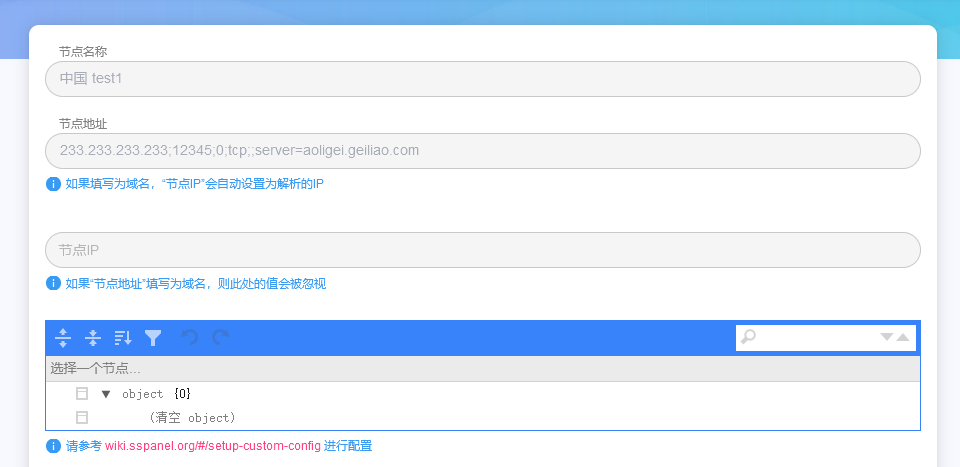

# 自建机场的一些坑（记录）

## 前言

因为手上的各种vps逐渐增多，因此产生了自建机场、无偿分享的想法。

技术路线打算采用sspanel+后端的组合

前端面板panel的开源地址：https://github.com/Anankke/SSPanel-Uim

后端xrayu的地址：https://github.com/XrayR-project/XrayR

注意：sspanel这帮人把文档墙了，并且脾气也很怪，所以大家遇到什么bug，建议不要去提issue或者在这个项目下查找是否有人遇到过。以下是几个典型冤大头

> https://github.com/Anankke/SSPanel-Uim/issues/1056
> 
> https://github.com/Anankke/SSPanel-Uim/issues/716

xrayu的讨论氛围则较为正常

## 技术选择

全部使用docker进行搭建

前端域名使用nginx-proxy结合acme.sh进行反代

xrayu中docker的文档描述非常清晰，这里不多讲

panel则是文档写的稀烂，很多bug和实现得翻源码连蒙带猜整出来，所以这里只是做个记录，大伙选择前端面板时可以用这个代替：https://github.com/Ehco1996/django-sspanel

## sspanel搭建

官方团队好像对docker比较抵触，因此教程非常少，个人参考了 https://github.com/du5/SSPanel-Uim-Docker 等第三方代码，这里给个dockercompose

```

version: '3'

services:
    sspanel:
        image: sspaneluim/panel
        container_name: sspanel
        restart: always
        ports:
            - 28081:80
        links:
            - mariadb
        volumes:
            - ./config/.config.php:/var/www/config/.config.php
        environment:
            - VIRTUAL_HOST=这里填nginx-proxy你的域名
            - VIRTUAL_PORT=80
        network_mode: bridge
        
    mariadb:
        image: mariadb:10.6
        container_name: mariadb
        restart: always
        volumes:
            - ./shit/mysql:/var/lib/mysql
            - ./shit/glzjin_all.sql:/docker-entrypoint-initdb.d/sspanel.sql
        environment:
          MYSQL_ROOT_PASSWORD: sspanel 
        network_mode: bridge

    phpmyadmin:
        image: phpmyadmin
        container_name: phpmyadmin
        restart: always
        ports:
          - 28080:80
        environment:
          - PMA_ARBITRARY=1
        network_mode: bridge

```

说明：glzjin_all.sql 这个去sspanel的git仓库下载，通过docker挂载到mariadb的启动脚本文件夹中

**glzjin_all.sql要自定义一下，打开后在开头加几行：**

```
CREATE DATABASE sspanel CHARACTER SET utf8mb4 COLLATE utf8mb4_unicode_ci;

CREATE USER 'sspanel'@'localhost';

GRANT ALL PRIVILEGES ON sspanel.* TO 'sspanel'@'localhost' IDENTIFIED BY 'sspanel';

FLUSH PRIVILEGES;

USE sspanel;
```

搭建好之后需要进到容器内初始化管理员账号(账号：666@666.com 密码：admin)

```
docker exec -it sspanel /bin/bash 

php xcat User createAdmin <<EOF
666@666.com
admin 
Y
EOF
```

至此前端搭建完成

## xrayu 后端搭建

首先我们在sspanel前端增加一个节点,这里就写最简单的v2ray配置

233.233.233.233是vps的ip，12345是端口



添加后前端会自动分配一个nodeid，假设是1

接下来放一下后端的config.yml

```
Log:
  Level: none # Log level: none, error, warning, info, debug
  AccessPath: # /etc/XrayR/access.Log
  ErrorPath: # /etc/XrayR/error.log
DnsConfigPath: # /etc/XrayR/dns.json Path to dns config, check https://xtls.github.io/config/base/dns/ for help
RouteConfigPath: # /etc/XrayR/route.json # Path to route config, check https://xtls.github.io/config/base/route/ for help
OutboundConfigPath: # /etc/XrayR/custom_outbound.json # Path to custom outbound config, check https://xtls.github.io/config/base/outbound/ for help
ConnetionConfig:
  Handshake: 10 # Handshake time limit, Second 注意！这里需要改大为10
  ConnIdle: 300 # Connection idle time limit, Second 同上，原始为10，需要改大为300，不然会出现链接不稳定的情况
  UplinkOnly: 2 # Time limit when the connection downstream is closed, Second
  DownlinkOnly: 4 # Time limit when the connection is closed after the uplink is closed, Second
  BufferSize: 10240 # The internal cache size of each connection, kB 同上，根据需求改大
Nodes:
  -
    PanelType: "SSpanel" # Panel type: SSpanel, V2board, PMpanel, Proxypanel
    ApiConfig:
      ApiHost: "这里填你的前端地址"
      ApiKey: "这里填你的前端config中muKey"
      NodeID: 这里填你的前端分配的nodeid
      NodeType: V2ray # Node type: V2ray, Trojan, Shadowsocks, Shadowsocks-Plugin
      Timeout: 30 # Timeout for the api request
      EnableVless: true # Enable Vless for V2ray Type
      EnableXTLS: true # Enable XTLS for V2ray and Trojan
      SpeedLimit: 0 # Mbps, Local settings will replace remote settings, 0 means disable
      DisableCustomConfig: true
      DeviceLimit: 0 # Local settings will replace remote settings, 0 means disable
      RuleListPath: # /etc/XrayR/rulelist Path to local rulelist file
    ControllerConfig:
      ListenIP: 0.0.0.0 # IP address you want to listen
      SendIP: 0.0.0.0 # IP address you want to send pacakage
      UpdatePeriodic: 60 # Time to update the nodeinfo, how many sec.
      EnableDNS: false # Use custom DNS config, Please ensure that you set the dns.json well
      DNSType: AsIs # AsIs, UseIP, UseIPv4, UseIPv6, DNS strategy
      DisableUploadTraffic: false # Disable Upload Traffic to the panel
      DisableGetRule: false # Disable Get Rule from the panel
      DisableIVCheck: false # Disable the anti-reply protection for Shadowsocks
      DisableSniffing: false # Disable domain sniffing
      EnableProxyProtocol: false # Only works for WebSocket and TCP
      EnableFallback: false # Only support for Trojan and Vless
      FallBackConfigs:  # Support multiple fallbacks
        -
          SNI: # TLS SNI(Server Name Indication), Empty for any
          Path: # HTTP PATH, Empty for any
          Dest: 80 # Required, Destination of fallback, check https://xtls.github.io/config/fallback/ for details.
          ProxyProtocolVer: 0 # Send PROXY protocol version, 0 for dsable
      CertConfig:
        CertMode: none # Option about how to get certificate: none, file, http, dns. Choose "none" will forcedly disable the tls config.
        CertDomain: "你的域名" # Domain to cert
        CertFile: /etc/XrayR/cert/你的域名.cert # Provided if the CertMode is file
        KeyFile: /etc/XrayR/cert/你的域名.key
        Provider: dnspod # DNS cert provider, Get the full support list here: https://go-acme.github.io/lego/dns/
        Email: test@me.com
        DNSEnv: # DNS ENV option used by DNS provider
          DNSPOD_API_KEY: 12312,121235456050542
```

然后再vps上运行docker即可，假设上述的config文件在root目录下

```
docker run -d \
    --name xrayr \
    -v /root/config.yml:/etc/XrayR/config.yml \
    --network=host \
    crackair/xrayr:latest

docker logs -f xrayr  #查看日志
```


## 结语

个人认为，无论是什么技术，永远都是老带新，新带萌的过程。

永远不要做资本的傀儡

共勉