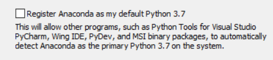
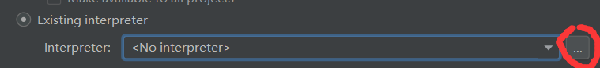
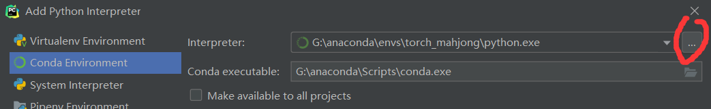
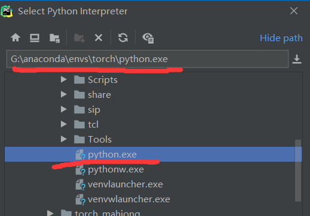

# 前言

~~可能，马上，应该要招新了，组长要我写个教程，我也正好记录一下关于这块的环境配置。~~

如果你是一名研究人员，或是一名对新兴事物感兴趣的极客，相信这套环境可以对你的工作提升极大的研究效率。

环境主要围绕 python，深度学习，大数据，爬虫等方面展开。即需要对数据进行直观的操作，显示，依赖于各种软件包（脚本小子），频繁的切换窗口比对数据等。

希望这篇博客能帮助你少走一些弯路，如果有更好的想法，欢迎在下面留言。

# 正文

## 环境安装

注意！**首先将电脑系统内的 python 卸载，就是直接从[python 官网](https://www.python.org/)下载的那个。**

原因：后续所有关于包管理的操作将在 anaconda 的虚拟环境中进行，而在导入 pycharm 虚拟环境时可能会与系统环境内部的 python 解释器相冲突。 所以希望各位在装环境前能有一个相对干净的 python 环境。

### anaconda 安装

1. 首先官网安装[anaconda](https://www.anaconda.com/)

这个选项要勾上，保证以后系统默认的 python 是 anaconda 内部的，方便以后管理。另一选项不用勾，英语好的可以自行分析。

### pycharm 安装

1. [官网](https://www.jetbrains.com/pycharm/)安装（有华科邮箱的可以免费使用专业版本，没有的可以下载社区版本，感觉现阶段没什么区别……）
2. 下载专业版本的同志可以在官网去注册，记得用学校邮箱，注册完后后会发个激活码到你的邮箱，打开专业版用这个码激活就行。也可以软件直接登录注册的账号，自动激活。
3. 没邮箱却想用专业版的同志可以：1，去主校区的网络中心怼人，叫管校园网的那帮伙计把你邮箱激活。2，网上找个方法破解。

## 环境配置

请各位老哥跟着以下的步骤依次进行

以安装 pytorch 为例,我们将新建一个名为 torch 的 conda 虚拟环境并将环境导入 pycharm,jupyter lab

### 换源

墙最近又变高了，没有国内镜像基本啥都下不动，感谢国内的各所高校做出的贡献。~~华科有 kali 的镜像，没想到吧！~~

#### conda 换源  
[清华官方教程](https://mirror.tuna.tsinghua.edu.cn/help/anaconda/)

`注意，网上csdn之类的教程没有更新，请根据最新的官方方法进行修改`

#### pip 换源  
   因为以后装包主要使用 conda,pip 尽量别使用([conda和pip的区别](#conda和pip的区别))  
   conda 无法完成安装时才使用 pip,因此就在这里介绍临时方法

```
pip 后加参数 -i https://pypi.tuna.tsinghua.edu.cn/simple
例1：pip install -i https://pypi.tuna.tsinghua.edu.cn/simple pandas

例2：我想安装tensorflow-gpu1.4.1,执行：
pip install -i https://pypi.tuna.tsinghua.edu.cn/simple tensorflow-gpu==1.4.1
```

### anaconda 配置

打开 anaconda prompt

```
# 先在base环境安装jupyter lab的相关包
conda install jupyterlab
conda install nb_conda

# 新建一个名为torch的py3.7虚拟环境
conda create -n torch python=3.7

# 进入torch环境
activate torch
```

开始安装各种包 ,pytorch 的安装在官网有命令[链接](https://pytorch.org/get-started/locally/)

ps:有老黄家显卡的可以选择包含 cuda 的版本,pytorch 安装与 tensorflow 不同,不需要专门下载 cuda,只需要显卡驱动更新就行

~~从官网复制命令时记得将最后的 -c pytorch 去掉,才能享受清华源的高速~~  
-c pytorch 现在不要删，
 各位同志可以查一下 conda -c 这个命令的作用  
 [conda命令的一些常用用法](https://www.jianshu.com/p/7ebe1df808ba)

```
# 安装pytorch(写博客时的官网命令,装的是含cuda的版本,各位最好去官网使用最新的命令)
conda install pytorch torchvision cudatoolkit=10.1 -c pytorch

# 安装各类必要包,只是举例,可以按需下载
conda install matplotlib
conda install scikit-learn
conda install scipy

# 安装虚拟环境下的jupyter依赖包
conda install ipykernel
```
### pycharm配置
打开软件后找个你喜欢的地方新建一个project  
解释器选择已存在的anaconda虚拟环境  


  
最后一个步骤选择安装anaconda所在位置的文件夹,内部的env文件夹内找到刚创建的torch环境

### jupyter lab配置
**此为选择项, 因为jupyter lab的社区并不完善,可能在配置过程中出现各种玄学问题,所以初学者可以不用jupyter lab**
anaconda prompt 中输入
```
jupyter lab --generate-config
# 输入命令后会在下方显示config文件的路径
```
打开jupyter_notebook_config.py文件编辑,添加以下语句
```
c.NotebookApp.notebook_dir = 'C:\jupyter'
# 用一个自己喜欢的文件夹就好,代表jupyter打开后默认所在的目录
```
懒得重复造轮子了,贴个博客,各位看着办……  
[插件配置](https://www.cnblogs.com/lskreno/p/10844315.html)

## 补充知识

### conda和pip的区别  
Conda和pip通常被认为几乎完全相同。虽然这两个工具的某些功能重叠，但它们设计用于不同的目的。 Pip是Python Packaging Authority推荐的用于从Python Package Index安装包的工具。 Pip安装打包为wheels或源代码分发的Python软件。后者可能要求系统安装兼容的编译器和库。

Conda是跨平台的包和环境管理器，可以安装和管理来自Anaconda repository以 Anaconda Cloud的conda包。 Conda包是二进制文件，徐需要使用编译器来安装它们。另外，conda包不仅限于Python软件。它们还可能包含C或C ++库，R包或任何其他软件。

这是conda和pip之间的关键区别。 Pip安装Python包，而conda安装包可能包含用任何语言编写的软件的包。在使用pip之前，必须通过系统包管理器或下载并运行安装程序来安装Python解释器。而Conda可以直接安装Python包以及Python解释器。

另一个区别是conda能够创建可以包含不同版本的Python或其他软件包的隔离环境。在使用数据科学工具时，这非常有用，因为不同的工具可能包含冲突的要求，这些要求可能会阻止它们全部安装到单个环境中。 Pip没有内置的环境支持，而是依赖于virtualenv或venv 等其他工具来创建隔离环境。 pipenv，poetry和hatch wrap pip和virtualenv等工具提供了统一的方法来处理这些环境。

Pip和conda在如何实现环境中的依赖关系方面也有所不同。安装包时，pip会在递归的串行循环中安装依赖项。没有努力确保同时满足所有包的依赖性。如果较早安装的软件包与稍后安装的软件包具有不兼容的依赖性版本，则可能导致破坏的环境。conda使用可确保满足环境中安装的所有包的所有要求。此检查可能需要额外的时间，但有助于防止创建破坏的环境，前期关于依赖关系包的元数据是正确的。

考虑到conda和pip之间的相似性，有些人试图将这些工具结合起来创建数据科学环境也就不足为奇了。将pip与conda结合的主要原因是有些包只能通过pip安装。 Anaconda创酷提供超过1,500个软件包，包括最流行的数据科学，机器学习和AI框架。这些，以及包括conda-forge和bioconda在内的数据通过Anaconda云提供的数千个附加软件包，可以使用conda进行安装。尽管有大量的软件包，但与PyPI上提供的150,000多个软件包相比，它仍然很小。有时候需要的包没有conda包，但在PyPI上有，可以用pip安装。

