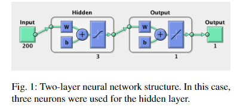
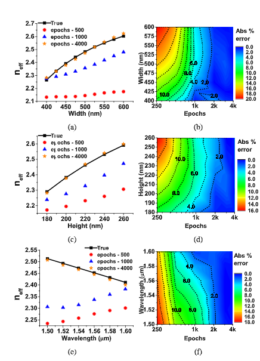
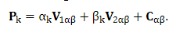
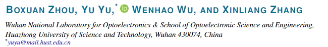

# 毕设论文手记

## 前言

毕设要求写个论文综述,网上查了一下综述是个什么鬼东西, 大概就是当前你这个话题的研究进展, 读一堆相关大佬(或者水逼)的论文,总结一下.
但是要求用word写,有点憨憨,所以先用md写个论文笔记,明天再丢到word里慢慢整格式.(贼jb难受兄弟)

## 大概研究方向

深度学习+微纳光子学=>逆向设计
没了,就这.

## 手上有的资料

导师给的俩文件夹,当初陈老师也给了一堆,大概都是一个套路:

1. 深度学习出来前:手动设计,计算量大,搞不倒.
2. 深度学习出来后:机器设计,效果不错,美滋滋.

> ps:估计我到时候的毕设也是这个套路...... 不期望在这里面学到什么猛男操作,就当锻炼自己的py编程水平吧 hhh

> pps: 对于用算法解决什么光学的问题我并不关心,只关心所用的算法.
>
>> 为什么?
>> 因为不同的光学问题用不同的软件仿真,但是最后优化的算法大同小异,具体问题具体分析,当然,对于有必要的还是会写下来.
>>

# 以下是正文

## IPRSN-2017-ITu1A.4.pdf

1. fdtd生成训练数据
2. 两层网络结构, 只用来预测输出
3. 结合二进制搜索(就是逐点贪心搜索),得到最终结果.
4. 总结:利用神经网络部分代替fdtd进行传统的设计合成.

## jlt-37-24-6080.pdf

1. COMSOL仿真,生成数据(集成硅光子设备?估计没啥区别)
2. 说传统仿真很慢,介绍了一下几个现在很火的机器学习框架...我大概知道后面是什么套路了...
3. 很遗憾,没有用到bn以外的网络结构,只对不同节点数量的bn结果进行了一波图像解说...
4. 它一直在比较pytorch和sklearn两种不同包的结果区别???原理不都一样的,还能有区别?

> 关于这点我真的没有看错,我又回头看了几遍,最后它说sklearn的效果更好????我查了一下这个期刊Journal of Lightwave Technology 影响因子4.162 参考oe:3.561 ol:3.866 ????投稿时间是DECEMBER 15, 2019,才出的,贼恐怖.对此我有俩种解释:
>
> 1. 这个期刊确实对这块交叉领域不熟(参考上次nature上出现的一篇很水很水的机器学习灌水文章,可能除了真正的计算机领域,其它地方对这块真的不怎么熟悉吧...)
> 2. 我太菜了,后面关于光学效果的对比没怎么仔细研究(我看不懂啊...有待学习)
>     看看这亮瞎眼的图
>    可能这块真的很强.回头问问老师,溜了溜了,下一篇.

## josab-36-4-999.pdf

1. 这篇叫光学无源元件(optical passiveelements),牛逼吧,分别是波导，径向波导元件（弯曲），定向耦合器和多模干扰（MMI）耦合器
2. 做的预测工作,单纯的预测,单纯.. 没找到网络结构的特别之处,还是单纯的全连接.
3. 又介绍(吹)了一波ann???ARTIFICIAL NEURAL NETWORK,啊,取个高端名字就是不一样啊
4. 用的仿真软件:OptiMODE,Lumerical MODE,不知道和fdtd什么关系.
5. 结论是:用神经网络来加强或代替传统软件的建模的速度和精度是可以哒.

## nusod19paper68.pdf

1. 亚波长集成光子器件
2. 这篇有点意思,用的传统机器学习,pca降维分析,找到主分量然后用回归分析
3. 个人总结:这篇给了新的思考,pca然后回归分析相当于人工提取特征,,再用人工提取的特征在特定的参数空间中搜索,得到的结果具有抽象意义上的相似性.这套操作应该是传统的统计机器学习方面的,以前好像了解过,很强.  比前面几篇强多了,短小精悍,没多余废话

## oe-26-22-29032.pdf

1. 标题里有个吸引子,感觉有点意思
2. Hopfield神经网络 Lyapunov稳定性定理 非线性动力学  自动控制 https://blog.csdn.net/weixin_39707121/article/details/79041536
3. 不知道这些事时代的眼泪还是时代的眼屎... 感觉很有点东西,虽然公式推导有些看不懂不求甚解 ，观其大略
4. > We want to note that the simulation time for the design of each proposed devices  took  two  months.The  computational  experiments  are  done  by  running  three  computers   in   parallel   fashion   to   speed-up   the   numerical   calculations.   The   hardware   specifications  of  the  corresponding  computers  are  as  follows:  Computer  1(3.3GHz  Intel  i7-3960x  CPU,  6  Cores,  32GB  RAM);  Computer  2(2.9GHz  Intel  Xeon  E5-2690  CPUx2,  2x8  Cores, 64 GB RAM); Computer  3 (2.26GHz  Intel  Xeon  X7560  CPUx2,  2x8  Cores,  512  GB  RAM)
   > 我们要注意的是，每个拟议器件设计的仿真时间都花了两个月。通过并行运行三台计算机以加快数值计算来完成计算实验。相应计算机的硬件规格如下：计算机1（3.3GHz Intel i7-3960x CPU，6核，32GB RAM）；计算机2（2.9GHz Intel Xeon E5-2690 CPUx2、2x8内核，64 GB RAM）;计算机3（2.26GHz Intel Xeon X7560 CPUx2、2x8内核，512 GB RAM）
   >
5. 应该是时代的眼屎了.
   > 1982年，著名物理学家约翰·霍普菲尔德发明了Hopfield神经网络。Hopfield神经网络是一种结合存储系统和二元系统的循环神经网络。Hopfield网络也可以模拟人类的记忆，根据激活函数的选取不同，有连续型和离散型两种类型，分别用于优化计算和联想记忆。但由于容易陷入局部最小值的缺陷，该算法并未在当时引起很大的轰动。
   >

## oe-27-21-29620.pdf

1. > 使用Keras [39]和Tensorflow [40]在相同的HPC集群上训练了两个神经网络。测试了数百种不同的体系结构。为了评估每种架构的有效性，使用了均方误差和确定系数（R2）度量。效果最好的波导神经网络具有4个隐藏层，其中包含128个神经元，64个神经元，32个神经元和16个神经元。每个神经元都使用双曲正切激活函数.Bragg光栅神经网络设计有10个隐藏层和128个神经元，并使用了RELU激活函数。没有使用辍学。两个网络都接受了16个样本批次大小的培训。虽然对波导神经网络进行了100个时间段的训练，但布拉格光栅神经网络只需要大约5个时间段即可达到足够的效果，这主要是由于训练集较大。为了提高网络的表达能力，对Bragg训练集进行了标准化。
   > 我们使用时钟频率为3.10 GHz，12 GB RAM的四核Intel（R）i5-2400 CPU进行了所有基准测试。为了评估波导ANN的速度，我们使用ANN和MPB串行模拟了各种波导参数。为了评估BG ANN的速度，我们使用ANN和LDMTMM串行模拟了各种光栅。我们线性拟合每个方法的结果，并比较斜率以检查加速。
   >
2. 不说了,老操作了

## osac-2-6-1964.pdf

1. 老操作
2. 这句话说得很好
   > 我们演示了一种使用人工神经网络的新型硅光子参数提取方法。我们的方法能够为复杂的设备（例如集成chi光栅）提取参数，而无需牺牲传统分析方法的速度。为了验证我们的方法，我们制造并测量了各种集成的rp光栅，并提取了实际参数。我们对该方法的准确性充满信心，但也注意到其他研究人员在实施此方法时应考虑的一些重要注意事项。首先，由数据集或训练过程本身引起的偏差可能不容易看出。尽管存在几种监视此类问题的训练技术[13]，但它们不能保证模型没有偏差。因此，如对此处介绍的设备执行的那样，应通过仔细的边界案例测试和验证来作为此方法的“黑匣子”实施方案的开头。 [16]中进一步描述了当前方法的严格数据生成过程和训练过程，并为该方法增添了很大的信心。其次，该模型的参数化方案相当基本，旨在表征一些基本的ICBG参数，而不是器件的完整结构组成。未来的工作可能会继续对该模型进行参数化，使其包含变迹和蚀刻深度等参数。尽管存在这些缺点，但是当前模型可以充分描述最直接影响ICBG反射和群时延分布的参数。机器学习模型具有一种独特的特性，即“转移学习”，因此，人们可以采用预先训练的模型，该模型经过特别狭窄的参数训练通过继续训练新的数据集来扩展空间并扩展其知识领域[23]。这使模型“众包”成为可能，开发人员和设计人员在其中模拟与特定问题相关的数据集，并在每个人之间共享一个通用模型。在培训，共享和使用此参数提取框架时，我们都鼓励这种思想。
   >
3. 虽然有些想说的,但是这里太小我写不下/滑稽

## osac-2-11-3343.pdf

1. emmmm熟人啊,哥这时候还在考研
   
2. matlab工具箱....
3. > As the near-field intensity pattern of this spiral device ishighly sensitive to incident SOP, a feed forward NN with high detection accuracy can already beobtained using a training-set consisting of only 300 samples, and thus the required computationfor training is acceptable even when there are large number of input nodes
   > 由于该螺旋装置的近场强度模式对入射SOP高度敏感，因此仅使用 `300`个样本的 `训练集`就已经可以获得具有高检测精度的前馈NN，因此即使在有条件的情况下训练所需的计算也是可以接受的输入节点数量很多
   >
4. 溜了溜了,利益相关,不便评价

## prj-7-3-368.pdf

1. 引言里提到了蒙特卡罗方法
2. 看看别人的数据量和设备
   > It takes us 30 h togenerate 20,000 training instances with NVIDIA Tesla P100GPU accelerators. In order to guarantee the generalizationof the training models, the ANNs are trained by using the20,000 instances, while another 2000 instances are left asthe test sets to validate the training effect.
   > 使用NVIDIA Tesla P100GPU加速器，我们需要30小时才能生成20,000个训练实例。为了保证训练模型的通用性，使用20,000个实例对ANN进行训练，而剩下的2000个实例作为测试集以验证训练效果。
   >
3. 用到了ga(遗传算法)来搜索超参数,也是一般的全连接结构

## s41598-018-37952-2.pdf

1. 这篇跟我的毕设目标有点相似
2. 感觉以前好像看过...讨论了不同深度,用残差网络等,最后也只是做了个正向预测.
