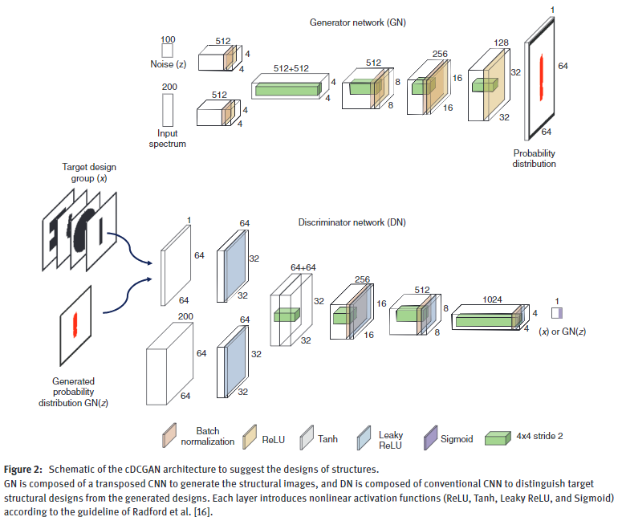
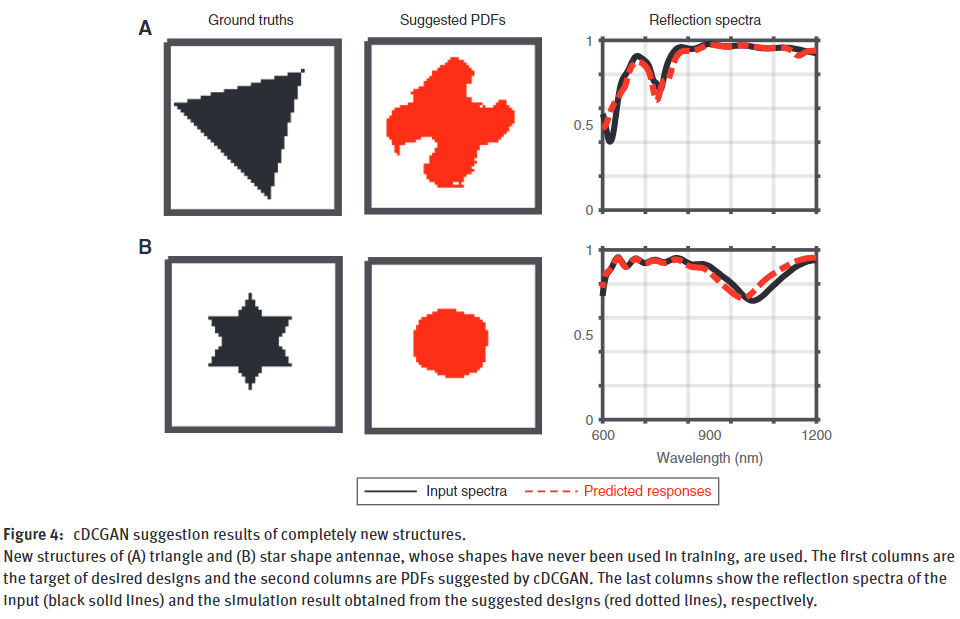

+++
title = "使用条件深度卷积生成对抗网络设计纳米光子结构 论文翻译"
description = "原作者：Sunae So and Junsuk Rho*"
date = 2020-02-08
updated = 2020-02-08
draft = false

[taxonomies]
tags = ["毕设","机器学习","光学","翻译"]

[extra]
math = true
math_auto_render = true
keywords = "脚本,服务器"
toc = true
+++

# 使用条件深度卷积生成对抗网络设计纳米光子结构
 Sunae So and Junsuk Rho*
 https://doi.org/10.1515/nanoph-2019-0117  
 Received   April 16, 2019; revised May 20, 2019;accepted May 22, 2019 

## 摘要
纳米光子学已经引入了基于深度学习的数据驱动设计方法，以减少耗时的迭代仿真，这是一个重大挑战。在这里，我们报告了条件深层卷积生成对抗网络（cdcgan）的首次使用，以设计不受限于预定形状的纳米光子天线。对于给定的输入反射光谱，网络以图像的形式生成理想的设计。这样就可以产生网络生成新的结构，而这些结构不能用结构参数来表示。从生成的设计获得的仿真结果与输入反射光谱非常吻合。通过为设计具有所需光学特性的复杂纳米光子结构提供一种快速便捷的方法，该方法为纳米光子学的发展开辟了新途径。  
关键词：纳米光子学；逆设计；条件深度卷积生成对抗网络；深度学习。
## 1.引言
纳米光子学的进步已经发掘了许多非凡的光​​学特性，例如掩盖物体，超出衍射极限的成像和负折射率。在纳米光子学中，亚波长天线与光相互作用，因此精确设计的组件可以提供有用的功能。尽管已经介绍了几种针对所需光学行为的系统设计方法，但纳米光子结构逆设计的程序仍主要依靠费力的优化方法。这种传统的设计方法需要耗时的迭代仿真。  

最近，已经提出了数据驱动的设计方法来克服这个问题。这些方法使用人工神经网络（NNs）设计纳米光子学结构。先前的研究首先设置要预测的结构的形状，例如多层或H天线，然后训练有素的NN提供实现所需光学特性的输出结构参数。训练完NN后，它们将提供相应的设计参数，而无需其他迭代仿真。这样的尝试大大减少了设计纳米光子结构的工作量和计算成本。到目前为止，这些方法仅适用于预定义基本结构的情况，其中只有结构参数是可预测的。最近，生成对抗网络（GAN）模型已被用于逆向设计元表面，以便提供任意模式的纳米结构。  

在本文中，我们提供了条件深层卷积生成对抗网络（cDCGAN）的首次使用来设计纳米光子结构。 cDCGAN是最近开发的用于解决GAN不稳定性问题的算法，并且提供了非常稳定的Nash平衡解。生成的设计以图像形式呈现，因此它们为所需的光学特性提供了基本上任意的可能设计，而不仅限于特定结构。我们的研究提供了在500 nm×500 nm范围内的64×64像素概率分布函数（PDF）的设计，这允许264×64的设计自由度  
## 2.结论与讨论
### 2.1 深度学习过程
对于深度学习，我们首先收集一个数据集，该数据集由10,150个银天线组成，具有六个代表性形状（圆形，正方形，十字形，蝴蝶，H形和V形）。数据集中的每个条目都由一个具有200个光谱点的反射光谱及其对应的具有64×64像素图像的横截面结构设计组成。 x和y方向均使用64个粗网格以进行简单计算。横截面结构设计以图像形式准备，其物理畴尺寸为500 nm×500 nm。将厚度为30 nm的天线放在50 nm MgF2垫片，200 nm银反射器和硅基板上（图1）。为了获得每个结构的反射光谱，使用商业程序FDTD Lumerical Solutions进行了有限差分时域（FDTD）电磁仿真。在f = 250–500 THz的整个光谱范围内进行仿真，并提取了200个光谱点。沿x和y方向使用周期性为500 nm的周期性边界条件，沿z方向使用完全匹配的边界条件。在每个模拟中，y偏振光以0入射角入射到天线上。当前的深度学习设置解决了在固定物理域和固定波长下的设计结构问题。若设计具有不同周期性或波长的结构则需要额外的数据收集或深度学习程序。  

  

图1 数据集中的每个条目均由FDTD仿真获得的反射光谱及其相应的截面结构设计组成。
    

下一步，我们使用Pytorch框架实现深度学习算法。最近，人工智能已经彻底改变了计算机视觉领域。卷积神经网络（CNN）是受人脑自然视觉感知机制启发而使用最广泛的技术。 CNN使用卷积运算符从输入数据中提取特征，这些特征通常是图像。因为每个通道都提取图像的重要特征，所以它大大提高了图像识别的效率。另一方面，GAN的发展导致了计算机视觉的重大进步。 GAN由生成图像的生成器网络（GN）和将生成的图像与真实图像区分开的鉴别器网络（DN）组成。训练GN生成真实的图像来欺骗DN，并且训练DN使其不被GN欺骗。这两个网络在每个训练步骤中都相互竞争；最终，竞争导致了每个网络的相互改善，因此GN可以生成比单独学习时更高质量的逼真的图像。 DCGAN结合了CNN和GAN的思想，提供了非常稳定的Nash平衡解决方案。我们采用cDCGAN算法，在这种情况下可以将反射光谱作为可控的条件输入。    

图2 cDCGAN架构的结构设计示意图。GN由反卷积组成以生成结构图像，而DN由常规的CNN组成以将目标结构设计与生成的设计区分开。根据Radford等人的指南，每一层都引入了非线性激活函数（ReLU，Tanh，Leaky ReLU和Sigmoid）。
    

图2显示了设计纳米光子结构的cDCGAN两个网络的体系结构：GN会生成结构横截面图像，而DN会将GN所生成的图像与用户指定的目标设计组区分开。 GN由四个转置的CNN层组成，分别由1024、512、256、128和1个通道组成； DN是具有四层的CNN。 GN接收100×1大小的随机噪声（z）和200×1大小的输入频谱的输入。 GN提供了从随机噪声生成的天线的概率分布函数（PDF）作为输出。输入光谱引导GN生成具有此类光学特性的PDF。相反，DN从用户提供的目标设计组（x）或GN，GN（z）生成的PDF图像中获取结构图像作为输入。 DN的作用是将GN（z）与目标设计组区分开。最终，对GN和DN进行竞争性同时培训：训练GN生成真实的结构设计以欺骗DN，并且训练DN区分目标设计与GN生成的设计。在数学上，对GN和DN的训练方向是最小化或最大化目标函数  

$$
\begin{aligned}
\min _{\mathrm{GN}} \max _{\mathrm{DN}} l(\mathrm{DN}, \mathrm{GN})=& E_{\mathrm{x}\leftarrow p_{\mathrm{data}}(x)}[\log \mathrm{DN}(x)] \\
&+E_{z \sim P_{z}(z)}[\log (1-\mathrm{DN}(\mathrm{GN}(z)))]
\end{aligned} \qquad (1)
$$  

其中DN（x）表示来自目标设计组（x）的结构图像的概率，而DN（GN（z））表示由GN生成的设计图像G（z）的概率。就DN而言，网络经过训练以针对来自目标设计的给定图像使用$E_{\mathrm{x} \leftarrow P_{\text {data }}(x)}[\log \mathrm{D} \mathrm{N}(x)]$给出E的最大期望值，以及$E_{z\sim p_{z}(z)}[\log (1-\mathrm{DN}(\operatorname{GN}(z)))]$对于GN生成的给定图像。另一方面，训练GN给出最小的期望值来欺骗DN。这种对抗训练使GN可以生成高质量的结构图像。  
除了对抗训练之外，我们还进一步修改了cDCGAN中GN的损失函数以适应我们的问题   

$$
l_{\mathrm{GN}}=(1-\rho) \times l_{\mathrm{GN}, \mathrm{design}}+\rho \times l_{\mathrm{GN}, \mathrm{adv}} \qquad(2)
$$  

其中$l_{\text {GN design }}$是设计损失，$l_{\text {GN adv }}$是等式(1)中定义的对抗性损失。$\rho$是对抗损失的比值。引入设计损失是为了明确指导GN很好地生成结构图像。它使用二元交叉熵准则直接测量目标设计$\left(x_{i}\right)$和生成的设计$\left(\hat{x}_{i}\right)$的两个概率分布之间的定量差异。  

$$
l_{\text {GN.design }}=-\left(x_{i} \log \sigma\left(\hat{x}_{i}\right)+\left(1-x_{i}\right) \log \left(1-\sigma\left(\hat{x}_{i}\right)\right)\right)\qquad(3)
$$    

其中σ是Sigmoid函数。  

我们优化了ρ，以使GN生成高质量的现实设计。对于低ρ，无法预期竞争效果，而高ρ会导致学习过程混乱。因此，选择合适的ρ= 0.5值可最大程度地提高GN产生令人信服的结构设计的能力。在每个训练步骤中，对网络进行训练以优化权重，以描述输入频谱和PDF之间的映射（有关深度学习过程和网络优化的详细信息，请参阅支持信息）。  

经过训练后，cDCGAN建议在64×64像素PDF $p(i, j)$上进行设计，这表示在位置$(i, j)$上存在银色天线的可能性。为了将PDF简化为表示该位置存在天线的二进制图像，我们根据Otsu采用了后处理步骤。该方法确定将黑白像素的类内方差$\sigma_{\omega}^{2}$最小化的二进制阈值t为   

$$
\sigma_{\omega}^{2}(t)=\omega_{0}(t) \sigma_{0}^{2}(t)+\omega_{1}(t) \sigma_{1}^{2}(t)
$$   

其中ω0和ω1代表用t分隔的两类概率的权重，$\sigma_{0}^{2}$是黑色像素的方差，$\sigma_{1}^{2}$是白色像素的方差。总之，对于给定的反射光谱，cDCGAN生成PDF，然后在后期处理步骤中将其转换为二进制设计图像。在每个训练步骤中，将使用2000个验证样本来验证训练后的网络。经过1000个训练步骤后，验证集的平均损失收敛为$5.564 \times 10^{-3}$。使用GTX 1080-Ti的单个GPU，训练网络一个时期大约需要4分钟。但是，一旦对网络进行了训练，训练后的网络就可以在3 s内生成所需频谱的设计。  
### 2.2 网络评估
训练有素的cDCGAN会根据先前训练或验证步骤中未使用的测试数据进行评估。随机选择的测试结果如图3所示。各种纳米光子天线的目标设计（图3的右上方）和相应的建议PDF（图3的右下方）显示出良好的定性一致性。为了对建议的PDF进行定量评估，基于这些建议的设计进行了FDTD仿真。将PDF转换为二进制设计，然后将其导入仿真中。建议图像的反射光谱与给定的输入光谱非常吻合。我们介绍了平均绝对误差（MAE）准则   

$$
l_{\text {error }}=\frac{1}{n} \sum_{i=1}^{n}\left|Y_{i}-\hat{Y}_{i}\right|
$$  

以定量测量从建议设计获得的FDTD模拟结果$\left(Y_{i}\right)$与最初馈入网络的输入光谱$\left(\hat{Y}_{i}\right)$之间的每个光谱点的反射光谱的平均误差。 12个测试样本的平均MAE误差为0.0322，这表明受过训练的网络可以实质上提供具有所需反射光谱的适当结构设计。有趣的是，即使天线具有相似的形状，如图3的第二列和底行所示，预测的频谱与输入的频谱也可能存在差异。这是由于所提供的PDF中的伪影较小。可以在后处理步骤中使用其他图像过滤器除去这些伪像（有关对后处理的影响，请参阅支持信息）。
  

图3 cDCGAN生成的图像的十二个示例及其仿真结果。每个面板均由反射光谱及其对应的结构横截面图像组成。右上的结构图像是目标设计（黑色），右下的图像是cDCGAN的建议图像（红色）。左侧的光谱显示了我们输入到网络中的所需输入光谱（黑色实线）以及从建议的设计中获得的预期响应（红色虚线）。
    

我们还使用全新的三角形和星形触角结构测试了cDCGAN，其形状在训练和验证数据集中不存在（图4A，B）。 cDCGAN产生了新的设计，这些设计扭曲了天线的形状，用于训练。结果表明，我们的cDCGAN可以建议任何不受结构参数约束的设计。生成的图像与目标设计不同，但是生成的反射光谱类似于输入的反射光谱。这是由于光学特性和设计之间的相关性不唯一：几个不同的设计可以具有相同的光学特性。在几种可能的设计中，结果最有可能出现在与训练后的数据集空间相差不大的区域。

图4 全新结构的cDCGAN建议结果使用了从未训练过的形状的（A）三角形和（B）星形触角的新结构。第一列是所需设计的目标，第二列是cDCGAN建议的PDF。最后一列分别显示输入的反射光谱（黑色实线）和从建议的设计获得的模拟结果（红色虚线）
    
   

最后，我们用随机生成的，手绘的类似于Lorentzian函数的光谱对cDCGAN进行了进一步测试（牛逼）  

$$
f(x)=\frac{2 a}{\pi} \frac{c}{4(x-b)^{2}+c^{2}}
$$    

我们使用了四种情况的参数设置：（A）a = 120，b = 900，c = 150，（B）a = 70，b = 850，c = 70，（C）a = 100，b = 1150，c = 70和（D）a = 80，b = 900，c = 80。对于每种情况，生成的图像及其对应的反射光谱如图5所示。四个示例的反射光谱的MAE为(a) 0.0496, (b) 0.0396, (c) 0.0409 (d) 0.0408。预测的响应在整体行为方面显示出与输入频谱合理的良好一致性。最有趣的是，生成的图像（图5A–D中的插图）与用于训练的形状有很大差异。这种特殊的结构形状不受预定义结构的限制，甚至是不可描述的。这是我们的方法相对于以前的方法的主要优点，后者只能建议给定的结构参数。结果还表明，cDCGAN实际上很好地学习了结构设计与其总体光学响应之间的相关性，因此可以广泛用于系统地设计纳米光子结构。

图5 手绘光谱的cDCGAN建议结果。（A）a = 120，b = 900，c = 150，（B）a = 70，b = 850，c = 70，（C）a = 100，b = 1150，c = 70，（D）a = 80，b = 900，c =80。每个图中的插图显示了cDCGAN建议的PDF。黑色实线表示输入到网络的类似于Lorentzian的输入函数，红色虚线表示从建议的PDF获得的仿真结果。
   

## 3.结论
最后，我们证明了cDCGAN首次用于设计纳米光子结构。 cDCGAN中的GN和DN这两个网络竞争性地学习建议具有所需光学反射特性的纳米光子结构的适当设计。我们的cDCGAN不仅限于建议预定义的结构，还可以生成新的设计。它具有$2^{64 \times 64}=2^{4096}$自由度的多种设计可能性。当前设计中使用的7.8 nm像素大小使得很难在此分辨率下制造建议的设计。可以通过将像素尺寸增加到20–30 nm的可行制造规模来克服这种制造困难。在这里，我们将输入限制为单个反射光谱。如果使用具有多个衍射级的多路复用输入光谱，则该方法还可以扩展到可能出现其他衍射级的衍射方案中。由于所使用的训练数据集的限制，并非总是能够生成具有非凡反射光谱的结构图像。通过收集可以代表异常反射光谱的其他数据可以克服这种弱点。尽管我们的示例设置了每一层的厚度和天线的材料类型，但也可以将它们添加为建议的输出参数。这种修改将允许人工智能完全独立地用于设计纳米光子器件，从而大大减少手动设计纳米光子器件的时间和计算成本。我们相信，我们的研究成果将通过解决结构设计的主要问题而导致纳米光子学的快速发展。  
## 4.补充材料 
补充材料可在期刊网站或从作者处获得。  
本文的网络版本提供补充材料（https://doi.org/10.1515/nanoph-2019-0117）
**致谢**：This  work  was  financially  supported  by   the   National   Research   Foundation   grants   (NRF-2017R1E1A1A03070501,   NRF-2019R1A2C3003129,   CAMM-2019M3A6B3030637,        NRF-2018M3D1A1058998,        and        NRF-2015R1A5A1037668) funded by the Ministry of Science and  ICT,  Korea.  S.S.  acknowledges  a  global  Ph.D.  fellow-ship (NRF-2017H1A2A1043322) from the NRF-MSIT, Korea.