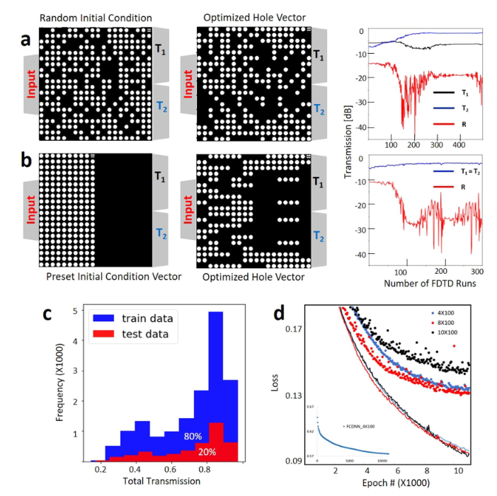
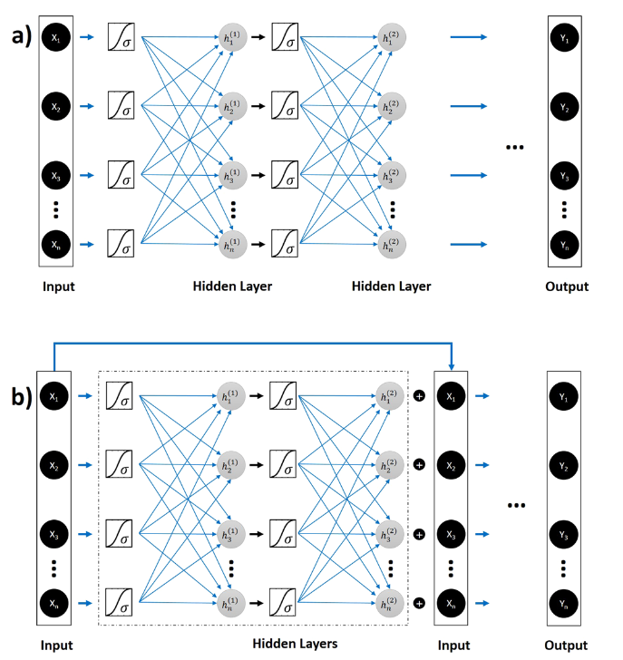
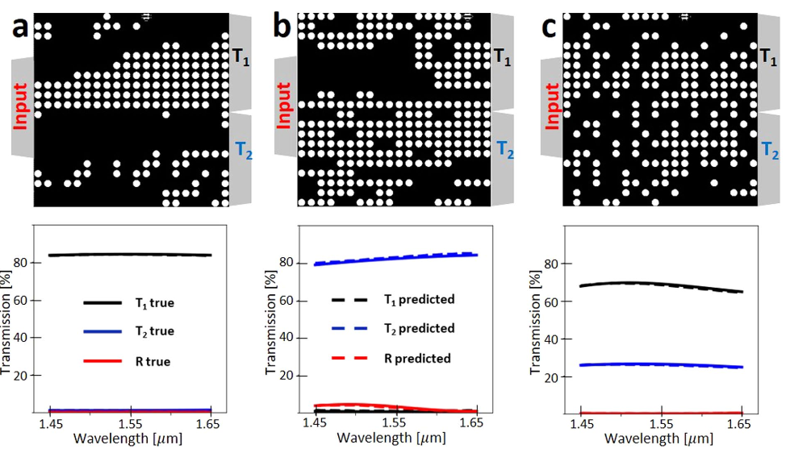
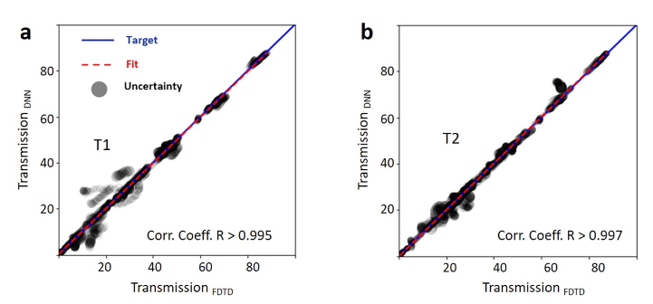
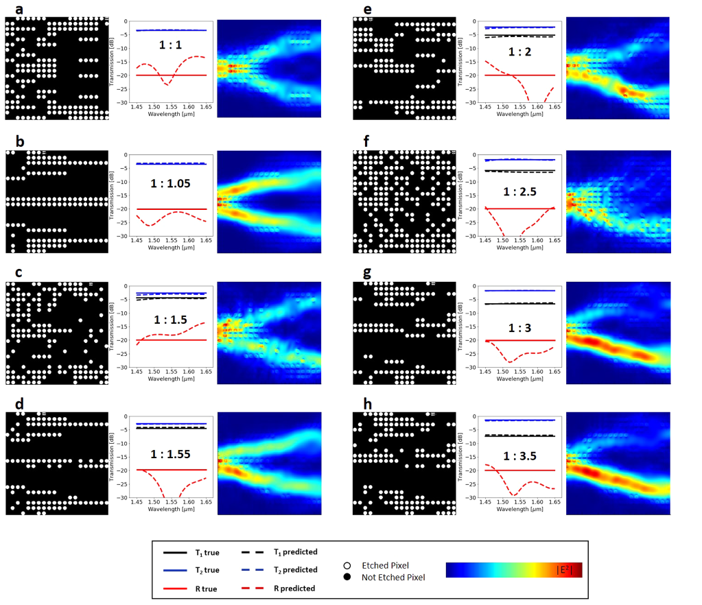
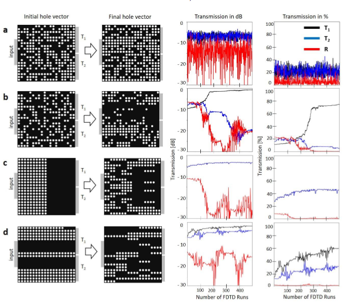
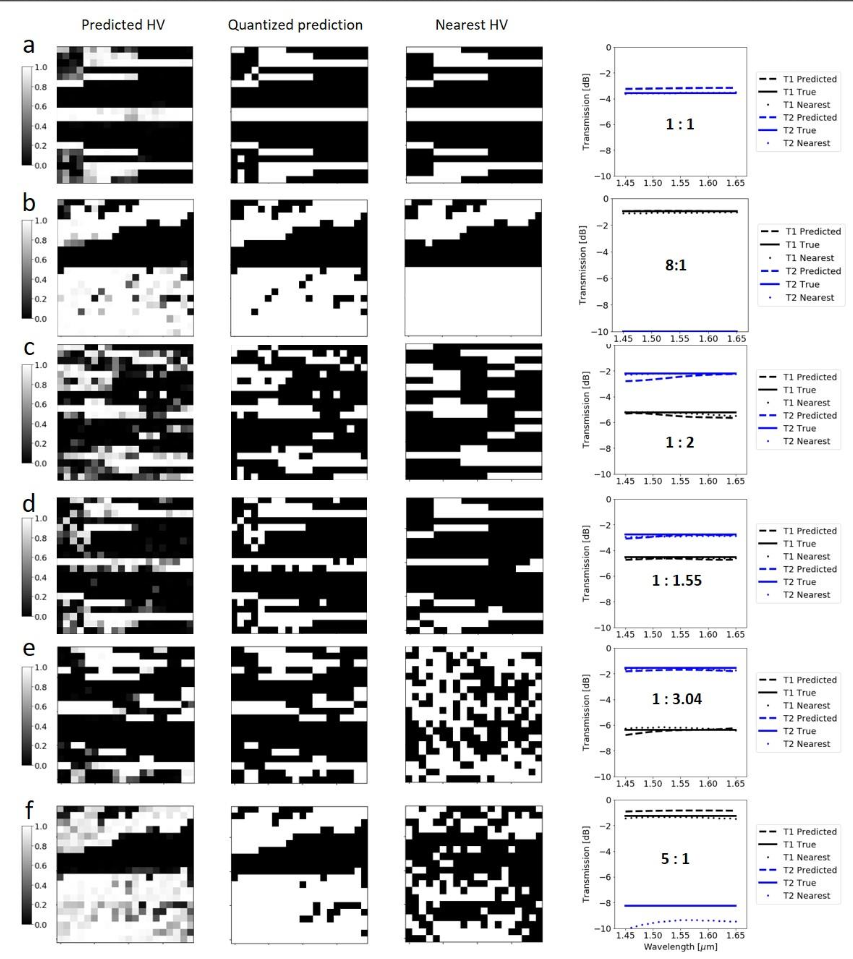

# 集成光子功率分配器的深度神经网络逆设计

Mohammad H. tahersima ,  Keisuke Kojima ,  toshiaki Koike-Akino, Devesh Jha  , Bingnan Wang, Chungwei Lin & Kieran parsons
 Received: 24 September 2018
 Accepted: 13 December 2018
 Published online:February 2019
原文地址:https://www.nature.com/articles/s41598-018-37952-2

## 摘要

对于科学和工程应用而言，预测人造结构材料的物理响应尤为重要。在这里，我们使用深度学习来预测人工设计的纳米光子设备的光学响应。除了预测任何给定拓扑的传输响应的前向近似之外，这种方法还允许我们对目标光学响应进行反向近似设计。我们的深度神经网络（DNN）可以设计紧凑型（2.6×2.6μm2）绝缘体上硅（SOI）的1×2功率分配器，并在不到一秒钟的时间内实现各种目标分配比。该模型经过训练，可将反射最小化（小于〜−20 dB），同时实现高于90％的最大传输效率和目标分割规格。这种方法为依靠复杂的纳米结构快速设计集成光子组件铺平了道路。

## 1.引言

人工设计的亚波长纳米结构材料可用于控制入射电磁波进入特定的透射和反射波阵面。最近的纳米光子器件已经使用了这种复杂的结构，从而以紧凑且节能的形式在光学，集成光子学，传感和计算元材料中实现了新的应用。然而，使用数值模拟来优化具有大量可能的特征组合的纳米结构在计算上是昂贵的。例如，根据光子设备的体积，通过有限差分时域（FDTD）方法计算电磁场轮廓可能需要很长的仿真时间（几分钟到几小时），以分析光传输响应。为了设计实现目标透射曲线的纳米结构，我们需要在大多数元启发式方法中执行大量的FDTD仿真。为了解决该问题，我们之前开发了一种使用神经网络（NN）的人工智能集成优化过程，该过程可以通过减少所需的数值模拟次数来证明神经网络如何帮助简化设计过程，从而加快优化速度

深度学习方法是通过非线性模型的组合而获得的表示学习技术，这些非线性模型以分层的方式将先前级别的表示转换为更高且稍微抽象的级别。主要思想是，通过级联大量此类转换，可以使用深度神经网络以数据驱动的方式学习非常复杂的功能。深度学习在建模复杂的投入产出关系方面的巨大成功吸引了一些科学界的关注，例如材料发现，高能物理学，单分子成像医学诊断和粒子物理学。它在光学界引起了一定的关注，最近有一些关于使用DNN设计纳米结构光学组件的逆向建模以及人工神经网络的硬件实现的反向工作。 NN可以用于预测拓扑的光学响应（正向设计），也可以用于设计目标光学响应的拓扑（逆向设计）。

光子结构的逆设计通常通过伴随灵敏度分析来证明。最近，D。Liu使用串联神经网络架构来学习厚度变化的交替电介质薄膜的非唯一电磁散射。 J. Peurifoy证明了神经网络使用深度为4层的完全连接的神经网络来近似SiO2和TiO2多层壳纳米粒子的光散射。在本文准备期间，浅野信华（T. Asano）提供了一个神经网络，用于预测二维光子晶体中的品质因数。受到这一进展的启发，我们的目标是训练一种神经网络，该网络可以按用户指定的比率即时设计集成光子功率分配器。集成光子设备的设计空间比以前演示的光散射应用程序大得多，后者需要强大的更深层次的网络，例如Deep Residual Networks（ResNet）

基于多模干扰（MMI）的集成光子分束器已被广泛用于将功率平均分配到输出端口。尽管可以将任意的分光比应用于各种应用，例如信号监控，反馈电路或光学量化36，但由于设计复杂性，几乎无法探索设计空间。田等(Tian et al)演示了在15×15μm2的器件尺寸中具有可变分光比的基于SOI的耦合器，带宽为60 nm，传输效率为80％37。徐等。针对3.6×3.6μm2器件占位面积的任意比例功率分配器，优化了正方形蚀刻像素的位置，以实现80％的效率

为了设计具有任意分光比的光子功率分配器，设计人员通常从基于解析模型的整体结构开始，然后在数值模拟中使用参数扫描对结构进行微调。在这里，我们证明了使用深度学习方法，可以在紧凑的深度残留神经网络模型中有效地学习宽带集成光子功率分配器的设计空间。这种方法可以根据规格进行设计，用户只需简单地要求特定的功率分配性能，并且几乎可以在不依赖费时的FDTD仿真的情况下，立即看到接近理想的解决方案。我们的设备在2.6×2.6μm2的占位面积上具有90％以上的传输效率，据我们所知，这是迄今为止最小的任意比率分束器。此外，我们的设计不依赖于任意的器件形态，并且被限制为半径为45 nm的蚀刻孔的20×20向量，可以通过当前的半导体技术方便地进行制造。

图1 DNN预测和逆设计过程概述。 （a）在功率分配器的输入端口将TE模式发射到标准SOI波导中（请注意，x和y方向上的比例不同）。 （b）占地面积为2.6×2.6μm2的纳米结构集成光子功率分配器的示意图。圆圈表示蚀刻孔的位置。通过优化蚀刻孔的位置，可以调节光传播到任一端口中。 （c）我们使用DNN对纳米光子设备进行正向和反向建模。 DNN可以将设备拓扑设计作为输入，将元设备的频谱响应作为标签，反之亦然。

## 2.深度学习用于正向建模以预测光学响应

### 2.1 仿真设置和数据集

当宽带光沿其路径遇到折射率不同的障碍物时，它会发生反射，折射和散射。纳米结构集成光子功率分配器的目标是利用各种光与障碍物发生的各种作用，将输入光束整体的导向某个端口以得到目标的功率。为了使用DNN设计功率比分配器，我们在标准的全蚀刻SOI平台上选择了简单的三端口结构。使用绝热锥将一个输入和两个输出0.5μm宽的端口连接到2.6μm宽的方形功率分配器设计区域，连接宽度为1.3μm（图1）。我们使用数值模拟（方法部分）来生成标记数据以训练网络。然后，我们为DNN提供数值光学实验，并训练一个神经网络，该网络能够表示每个端口的空穴矢量和光谱响应之间的关系。最初，我们的输入数据是几个20×20的空穴向量（HV），每个向量都由端口1（T1）和端口2（T2）的光谱传输响应（SPEC）以及来自输入端口（R）的反射标记。每个像素都是一个半径为45 nm的圆，使用常规光刻方法即可轻松制造。每个像素的二进制状态分别为1（被蚀刻）（n = nsilicon）和0（未被蚀刻）（n = nsilica）（请参见方法）。改变孔位置处的折射率会修改功率分配器内部的局部有效折射率，从而确定设备中行波的传播路径。

图2 我们使用各种数据训练DNN网络。每个数据集都以初始条件，蚀刻的孔密度和优化光谱响应的度量开始。我们生成大约20,000个蚀刻的孔向量作为数据，每个与它的传输响应相关联作为标签。在这里，我们介绍两个数据集：（a）非对称情况下使用随机初始向量最大化$\min \left(T_{1}\right)+\min \left(T_{2}\right)-\alpha \times \max (|R|) \quad(\alpha=2)$（b）对称情况下使用随机初始向量最大化$\min \left(T_{1}\right)+\min \left(T_{2}\right)-\alpha \times \max (|R|) \quad(\alpha=4)$   T1和T2分别是端口1和2的发射功率； R是反射到输入端口的光功率。对于对称情况，端口1和端口2的传输相同（T1 = T2）。 （c）通过数值方法在1550 nm处约20,000个功率分配器拓扑收集的所有传动系统和测试数据标签的直方图。 d）对于隐藏层宽度恒定为100且深度为4、8和10的网络，约10,000个训练周期的训练（线）和测试（点）的学习曲线。通过增加多达8层的网络深度，可以减少网络丢失。插图显示了FCDNN的最佳情况（4层），其损耗值大得多，约为0.58。在这里，所有损失函数均基于负对数似然率。

我们使用随机选择的HV和精心选择的模式化初始HV（请参见图2a和补充图S1），并使用启发式优化方法对各种优化指标进行优化以优化频谱传输值，以收集用于监督学习的各种标记训练数据。在对称搜索的情况下，我们强制X轴上的HV对称，并利用拓扑的对称性将搜索空间从400个像素减少到200个像素。此外，由于对称边界条件。因此，对称设备的光谱响应T1和T2相等（图2b）。输入和输出波导以及对称和不对称情况的其他几何细节是相同的。对于图2所示的两种情况，我们都从初始孔向量开始优化，并使用单步跨度二分查找法来最大化$\mathrm{FOM}=\min \left(T_{1}\right)+\min \left(T_{2}\right)-\alpha \times \max (\|R\|)$ （对于α= 2和4）分别针对图2a和b。我们的设计目标是实现紧凑的纳米结构功率分配器，具有高传输效率和最小的背反射。低背反射非常重要，因为在有源集成光子电路中，将背反射降至最低非常重要。这就是为什么我们在优化指标中使用大于2的反射因子来强调最小化这些功率分配器中的背反射的原因。我们针对约20个不同的初始条件和分割比率目标重复此过程，并为非对称情况添加镜像数据，以收集总共约20,000个数据及其相应的光谱标签（图2c）。

对于正向问题，输入是对应于孔位置的二进制图像的二维20×20 HV阵列。我们训练DNN来预测SPEC向量，该向量是具有63个元素的一维向量。 SPEC包括宽带光谱数据（1450至1650 nm），用于在输出端口T1和T2传输以及对输入端口R的反射。对于逆向设计，SPEC被用作输入，并且空穴矢量被视为标签。正向问题作为回归问题得到解决，我们使用高斯对数似然函数来训练模型。相反，反问题作为分类问题解决，我们在其中预测代表孔位置的二元向量。因此，我们使用伯努利对数似然分类器作为损失函数来训练反问题。高斯对数似然损失函数由以下方程式表示

$$
-\log P(Y | X, W)=\frac{1}{K} \sum_{n}^{K}\left(\frac{1}{2} \log \left(2 \pi \sigma^{2}\right)+\frac{1}{2 \sigma^{2}}\left(y_{n}-W^{T} x_{n}\right)^{2}\right)\qquad(1)
$$

其中 $P(Y\|X,W)$ 表示概率模型，W表示模型参数，K是训练数据的数量。损失函数使用亚当优化算法进行优化40。在固定次数的迭代之后终止训练，以确保收敛（图2d）。我们训练有素的广告网络的训练和验证结果相似，因此我们没有使用任何正则化来拟合。

对于这两个问题，我们首先使用具有多层的完全连接的DNN（FCDNN），其中每一层都有100个神经元。层数被认为是在数值实验中优化的超参数。但是，我们发现增加FCDNN的深度并不能改善网络的性能。因此，我们使用残差深度神经网络（ResNet）将正向和逆向问题的训练深度提高到8个隐藏层（有关常规DNN和ResNets的定量比较，请参见图2d）。解释一下，FCDNN通常会遇到梯度消失的问题。因此，增加FCDNN的深度并不一定会改善性能。 ResNet旨在通过使用“身份快捷方式连接”来规避此问题，其基本假设是，优化残差映射比优化原始的未引用映射更容易（图3）。经验证明，与FCDNN35相比，ResNets在训练深度架构方面具有更大的灵活性。主要思想是ResNet使用附加的标识函数来允许渐变的平滑向前和向后传播。

图3 普通FCDNN（a）和ResNet DNN（b）的网络架构，用于集成纳米光子学的逆向设计。我们在两种网络体系结构中都使用了S型（σ）激活函数。 FCDNN的深度增加并不一定会改善性能。 ResNet旨在使用附加的身份功能来通过增加网络深度来实现准确性。

### 2.1 结论

为了测试纳米结构的功率分配器网络，首先，我们从用于训练网络的同一组模拟数据中使用了随机选择的，看不见的20％数据。测试数据集有助于防止模型过度拟合训练数据（图2d）。

在下文中，我们介绍了用于从HV进行光谱正向预测的网络结果（图4），以及根据给定的物理可行SPEC规范反向设计HV（图5）。首先，我们测试网络的正向计算，以查看未训练网络的拓扑的频谱响应的预测。有趣的是，该网络可以非常准确地预测透射光谱和反射光谱（图4和5）。

图4 使用深ResNet进行频谱近似。我们使用16,000（占总数的80％）输入数据进行培训，并使用4,000（占总数的20％）数据进行测试。 a，b和c是三个代表功率分配器的ResNet预测光谱响应与数字验证光谱响应的比较。黑色，蓝色和红色分别表示在端口1传输，在端口2传输和在输入端口反射。实线是给定孔向量的真实值，虚线是使用ResNet预测的光谱响应。

图5 相关系数。将ResNet的预测传输值与端口1（a）和端口2（b）的真实传输值进行拟合。在整个传动比范围（0到1）中，相关系数R都高于0.995，并且随着传动比的增加，趋近于1。灰色圆圈符号大小与梯度不确定度成正比。

为了量化预测精度，我们使用了一个相关图，该图将真实的数字验证光学响应与DNN预测进行了比较。 DNN预测的相关系数高于99％（图5）。我们使用负对数似然成本函数的方差作为确定神经网络置信度的一种手段，并将其显示为相关图中预测不确定性的面积。我们观察到预测的置信度在较低的传输方式下较低，而在较高的传输方式下则提高。这是可以预期的，因为训练数据主要包含高传输设备（图2d）

我们通过使用SPEC作为数据并使用HV作为标签，并对反向网络进行逆向优化来对与上述相同的数据进行逆向建模测试。为了测试网络的泛化能力，我们研究了网络在任意和不熟悉的情况下的逆设计性能。为此，我们生成了一个包含每个端口的宽带常数传输值的参考表，并将它们用作逆向设计DNN模型的输入数据批。伯努利分布分类器的预测HV可以取0到1之间的任何值。随着训练次数的增加，损耗减少，分类收敛到0或1。生成的量化二进制序列包含未训练模型的特征（补充图2），然后将这些特征反馈到数值求解器中以评估预测性能。下一步，我们运行独立的FDTD模拟以检查响应的有效性（图6）。对于1：1、1：1.05、1：1.5、1：1.55、1：1.55、1：2、1：2.5、1：3和1：3.5的8种分光比，在1550 nm中心波长处的数值模拟电场传播显示出各种基于经典MMI的分束器的功率分配机制。 1：1和1:05分裂时的电场分布强度几乎是对称的。另一方面，对于不对称的分光比器件，电场强度是不对称的（如预期的那样），并且对于具有较大输出T2的一侧，光束路径会变宽。

图6 DNN逆向设计演示。我们将ResNet DNN逆向设计用于90％高效功率分配器。在这里，我们显示了8个代表性的设备，它们从a到h的分配比例分别为1：1、1：1.05、1：1.5、1：1.55、1：2、1：2.5、1：3和1：3.5。光谱响应图显示，预测的二进制模式的经过数值验证的透射和反射光功率（虚线）与目标宽带光谱（实线）非常匹配。使用FDTD仿真计算在1,550 nm处运行的每个设备的电磁能量密度图（右）。

Ab和cd对的目标光谱响应的预测拓扑显示相似光谱响应的不同外观模式。这是有道理的，因为可以为单个电磁问题提供多种解决方案。针对每种模式，演示了通过预测的功率分配器进行的FDTD模拟光功率传播。在图6所示的所有八种情况下，传输效率均超过90％，据我们所知，这是集成功率分配器中展示的最高传输效率。这也是第一次考虑最小化反射。尽管我们的目标并不是最大程度地提高工作带宽，但我们的功率分配器显示出1450至1650 nm之间的宽带传输。此外，我们将1550 nm波长的反射目标设置为-20 dB。除了图6c的情况外，我们在1550 nm处实现的反射响应小于-20 dB。图6所示的预测反射响应和实际反射响应出现明显差异的主要原因是因为光谱响应以对数刻度显示。实际上，差异很小。

## 讨论

NN可用于获取设备结构数据（形状，深度和介电常数）以预测纳米结构的光学响应（正向网络）。在这种情况下，可以将NN用作快速近似光学响应的方法，而不是使用计算量大的数值方法。使用NN的另一种方法（在常规数值方法中不可用）是将光学响应作为输入并为用户提供近似的解决方案纳米结构（逆设计）。尽管DNN最初出于训练目的需要大量数据集，但可以在计算集群上并行处理多个启发式优化指标，以加快生成训练数据的速度。一旦对网络进行了训练以将拓扑表示为光学响应，反之亦然，则可以在几分之一秒内设计出纳米结构。

我们利用ResNet DNN架构来使用其他身份功能，以允许平滑地向前和向后传播渐变。这使我们可以将网络深度增加到8层。我们观察到，对于10×100结构（10层深和100个神经元宽），ResNet DNN中仍然存在一些过拟合问题。由于从数据中学习到的参数数量取决于DNN中神经元的数量，因此10×100具有训练期间学习到的最大参数数量。尽管这在训练过程中提供了良好的性能，但会导致数据过拟合。可以在DNN中包括Dropout，以进行正则化并进一步增加隐藏层的深度；但是，这留作以后的工作。

总之，我们已经证明了DNN在纳米结构集成光子组件设计中的应用。尽管针对此问题的设计空间非常大（2400种可能的组合），但是通过使用近20,000个模拟数据训练DNN，我们训练了一个网络，该网络可以在此设计空间内近似任意孔向量的光谱响应。此外，我们可以使用逆网络为任何用户特定的功率分配比设计几乎优化的功率分配器拓扑。 DNN预测拓扑光学响应的能力和逆设计在纳米结构光子系统的设计中广泛使用这些网络中具有前景。图3：普通FCDNN（a）和ResNet DNN（b ）用于集成纳米光子学的逆向设计。我们在两种网络体系结构中都使用了S型（σ）激活函数。 FCDNN的深度增加并不一定会改善性能。 ResNet旨在使用附加的身份功能来通过增加网络深度来实现准确性。

## 方法

### 数值仿真

我们使用Lumerical的FDTD仿真包来生成训练数据。数据包含20,000多个数值模拟，其中每个实验都是由无源SOI波导和分束器设备组成的3D FDTD模拟。分束器的初始随机孔位置矩阵是使用MATLAB自动化生成，导出和处理的。孔位置生成脚本使用不同的算法（例如直接二进制搜索），初始条件和优化指标来依次创建设备结构的可靠神经网络表示所需的足够大的数据集。一台配备了Core i7 CPU（时钟频率为3.7 GHz）和64 GB RAM的台式计算机花了大约两周的时间才能完成20,000个仿真数据的收集。

宽带模拟在1.45-1.65μm范围内的所有模拟中均使用了文献41中硅和二氧化硅的色散折射率。输入源使用1550 nm的基本TE模式，记录TE模式的输出功率以进行透射和反射。我们注意到TM模式的输出低于10−5。图4.使用深ResNet的频谱近似。我们使用16,000（占总数的80％）输入数据进行培训，并使用4,000（占总数的20％）数据进行测试。 a，b和c是三个代表功率分配器的ResNet预测光谱响应与数字验证光谱响应的比较。黑色，蓝色和红色分别表示在端口1传输，在端口2传输和在输入端口反射。实线是给定孔矢量的真实值，虚线是使用ResNet预测的光谱响应图5相关系数。将ResNet的预测传输值与端口1（a）和端口2（b）的真实传输值进行拟合。在整个传动比范围（0到1）中，相关系数R都高于0.995，并且随着传动比的增加，趋近于1。灰色圆圈符号大小与梯度不确定度成正比。

### 深度神经网络（DNN）

我们使用python语言使用Tensorflow的开源机器学习框架来构建和测试我们的深度神经网络。训练神经网络模型的运行时间取决于网络和训练参数，包括数据大小，隐藏层深度和宽度，批处理大小和时期数。训练神经网络模型的运行时间取决于网络和训练参数，包括数据大小，隐藏层深度和宽度，批处理大小和时期数。对于代表性的网络参数，隐层宽度为100，隐层深度为8，批处理大小为100，历元数为10,000，并经过20,000个数据训练，如图2d所示，它需要1337秒（〜22分钟）训练模型。

# 补充图片

图S1：我们用一组不同的数据训练网络，每组数据都从初始条件，蚀刻的孔密度和各种指标开始，以优化光谱响应。我们使用透射标签生成约20,000个蚀刻的孔向量数据。在这里，我们显示了四组这些数据：

a）蚀刻孔在分束器盒中的随机放置
b）不对称搜索优化以使用随机初始向量最大化T1
c）对称搜索以使用模式化的初始向量最大化min（T1）+ min（T2）-4 * max（abs（R））
d）通过图案化的初始孔向量使非对称搜索最大化min（T1）+ min（T2）abs（min（T1）2 * min（T2））

图S2：比较6种不同分割率下具有相似分割率（SPEC）的预测模式和训练模式（HV）。预测孔向量的元素可以具有0到1之间的数字（预测HV）。我们通过将大于中点的数字四舍五入并小于中点的数字四舍五入来量化此向量（量化预测），然后将其返回到数值求解器以计算图案化功率分配器的频谱响应。接下来，我们找到与真实响应（所需响应）最接近的光谱响应，并显示其对应的HV（最接近的HV）。这些结果表明，训练后的模型没有存储训练数据。

