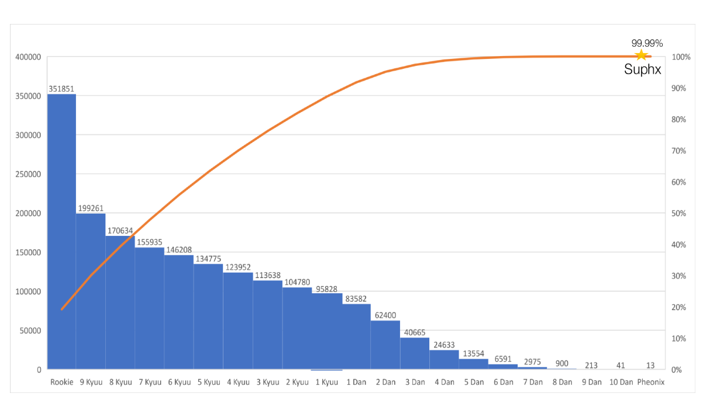

# 通过深度强化学习称霸麻将

Junjie Li,Sotetsu Koyamada,Qiwei Ye,Guoqing Liu,Chao Wang,Ruihan Yang,Li Zhao,Tao Qin,Tie-Yan Liu,Hsiao-Wuen Hon

Microsoft Research Asia(微软亚洲研究院)

Kyoto University(东京大学)

University of Science and Technology of China(中科院大学)

Tsinghua University(清华大学)

Nankai University (南开大学)

(害怕)
原文地址:https://arxiv.org/pdf/2003.13590.pdf

## 摘要

人工智能（AI）在许多领域都取得了巨大的成功，并且自AI诞生以来，游戏AI就被广泛视为其滩头阵地(beachhead 应该就是很重要的意思)。最近几年，关于游戏AI的研究已从相对简单的环境（例如，诸如围棋，国际象棋，将棋等完美信息的游戏，或诸如德州扑克的两人游戏等不完全信息的游戏）发展成更为复杂的环境（例如，多人不完美信息游戏（例如多人德州扑克和StartCraft II）。 麻将是一种在全球范围内流行的多玩家不完美信息游戏，但由于其复杂的玩法/得分规则和丰富的对局信息，对AI研究具有很大的挑战性。我们基于深度强化学习和一些新引入的技术（包括全局奖励预测，上帝视角(oracle)的指导和运行时策略自适应）为麻将设计了一个名为Suphx的AI。 Suphx在稳定排名方面已表现出比大多数顶级人类玩家更强的表现，并且在Tenhou(天凤)平台中，在评级中超过了99.99％的官方排名人类玩家。这是计算机程序首次超过麻将中大多数顶尖人类玩家的表现。

## 1.引言

为游戏构建超越人类的程序是人工智能（AI）的长期目标。在过去的二十年中，游戏AI取得了长足的进步。最近的研究逐渐从相对简单的完美信息或两人游戏（例如将棋，国际象棋，围棋和抬头的德州扑克）发展为更加复杂的不完美信息的多人游戏（例如桥牌 ，Dota，StarCraft II和多人游戏 德州扑克）。

麻将游戏是一款具有不完美信息和多个玩家的多轮麻将游戏，在全球数亿玩家中非常受欢迎。在麻将游戏的每一轮中，四名玩家相互竞争，以最先凑齐特定的手牌来取得胜利。建立强大的麻将程序对当前有关游戏AI的研究提出了巨大挑战。

首先，麻将计分规则复杂。每个麻将游戏包含多个回合，并且游戏的最终排名（以及相应的奖励）由这些回合的累积回合得分确定。一轮比赛的失败并不总是意味着玩家在该轮比赛中表现不佳（例如，如果他/她在前几轮中有很大优势，则该球员可能会战术上失去第一轮比赛以确保游戏排名第一），因此我们不能直接使用回合得分作为学习的反馈信号。此外，麻将有很多可能的获胜手牌。这些获胜手牌可能彼此之间非常不同，并且不同的手牌会导致该回合的不同获胜得分。这种计分规则比以前研究过的游戏（包括国际象棋，围棋等）要复杂得多。专业玩家需要仔细选择要形成哪种类型的获胜手牌，以权衡该回合的获胜概率和获胜分数。

其次，在麻将中，每个玩家手中最多拥有13个其他玩家看不到的私人手牌，并且在最后的牌山里有14张牌（在整个游戏中所有玩家都看不到），而在场上的则有70张牌，一旦被玩家抽出并丢弃，便会变得可见。结果，平均而言，对于每个信息集（玩家的决定点），有1048多个隐藏状态无法与他/她区分开。如此大量的隐藏信息使麻将游戏成为比以前研究的德州扑克游戏更困难的不完全信息游戏。麻将玩家很难仅根据自己的私人牌来确定哪个动作是好的，因为动作的优劣很大程度上取决于其他玩家的私人牌和每个人都看不到的牌山。因此，AI很难将其后的奖励信号联系到观察到的信息.

第三，麻将的游戏规则很复杂：（1）有多种类型的动作，包括立直，吃，碰，杠，弃牌，（2）进行鸣牌（碰或杠）,胡牌（宣告胜出）,或者抢杠时，常规的打法顺序会被打断。由于每个玩家最多可以拥有13张私有手牌，因此很难预测这些打断，因此我们甚至无法构建常规的游戏树；即使我们构建了游戏树，这样的树在玩家的连续动作之间也会有大量的路径。这阻止了将先前成功的技术直接应用于游戏，例如蒙特卡洛树搜索和crf(counterfactual regretminimization).

由于上述挑战，尽管进行了几次尝试，但是最好的麻将AI仍然远远落后于顶尖的人类玩家。

在这项工作中，我们构建了Suphx（Super Phoenix的缩写），这是一种用于4人麻将（日麻）的AI系统，该麻将规则拥有世界上最大的麻将社区之一。Suphx采用深度卷积神经网络作为其模型。首先通过从人类职业玩家的对局中进行监督学习来对网络进行训练，然后以网络为策略，通过自学强化学习（RL）来增强网络。我们将流行的策略梯度算法用于自演RL，并介绍了多种技术来应对上述挑战。

1. 全局奖励预测可以训练预测者根据当前和先前回合的信息来预测游戏的最终奖励（在未来几个回合之后）。该预测器提供有效的学习信号，以便可以执行策略网络的训练。此外，我们还设计了超前预测功能，对不同获胜手及其一轮获胜分数的丰富可能性进行编码，以支持我们强化学习的决策。
2. 上帝指导引入了一个拥有上帝视角的代理，该代理可以查看所有的信息，包括其他玩家的私有手牌和牌山。由于（不公平的）完美信息访问，该上帝代理是超级强大的麻将AI。在我们的RL训练过程中，我们逐渐从上帝代理中删除完美信息，最后将其转换为仅将可观察信息作为输入的普通代理。在上帝代理的帮助下，我们的常规代理比标准RL训练（仅利用可观察的信息）的改进要快得多。
3. 由于麻将的复杂游戏规则导致游戏树不规则，并阻止了蒙特卡洛树搜索技术的应用，因此引入了参数蒙特卡洛策略自适应（pMCPA），以提高代理的运行时性能。当游戏进行并且可以观察到更多信息（例如，四个玩家丢弃的牌河）时，pMCPA会逐步将离线训练的策略修改为适应当前阶段中的特定回合。

我们在最受欢迎和最具竞争力的麻将平台天凤上对Suphx进行了评估，该平台拥有超过350,000的活跃用户。 Suphx达到了10丹，其稳定的排名（描述了玩家的长期平均表现）超过了大多数顶级人类玩家。

## 2.Suphx概述

 表1：Suphx中的五个模型

### 2.1 决策流程

由于麻将的复杂游戏规则，Suphx学习了五个模型来处理不同的情况：弃牌模型，立直模型，吃模型，碰模型和杠模型，如表1所示。

除了这五个学习的模型外，Suphx还采用了另一个基于规则的胡牌模型，来决定是否宣布胡牌并赢得本轮比赛。此模型简单的检查获胜的牌是否可以由其他玩家丢弃的牌或从牌山上抽出来形成，然后根据以下简单规则进行决策：

* if 这不是比赛的最后一轮，则胡牌并赢得一轮；
* if 这是比赛的最后一轮，
  - if 在胡牌获胜后，整个游戏的累积回合分数是四名玩家中最低的，则不进行胡牌；
  - else 胡牌并赢得这个回合。

麻将玩家需要采取两种行动，我们的AI Suphx也需要采取行动（见图1）：

 图1：Suphx的决策流程。

* 抽牌：Suphx从牌山上抽出一张牌。如果它的手牌能够与这张进张形成胡牌的牌型，则获胜模型将决定是否宣布胡牌。如果是，它将声明胡牌并且回合结束。如果不是:

  1. 杠步骤：如果当前的手牌可以与抽出的牌形成暗杠或者加杠，则杠模型确定是暗杠还是加杠。如果不是，请转到立直步骤；否则，有两种情况：
     (a) 如果是暗杠，则进行暗杠并返回到抽牌的步骤。
     (b)如果是加杠，则其他玩家可以枪杠赢得回合。如果其他玩家获胜，则该回合结束；否则，进行加杠并返回到抽牌步骤.
  2. 立直步骤：如果手牌可以用抽到的进张进行立直，则立直模型决定是否声明立直。如果不是,则转到“弃牌”步骤；否则，则声明立直，然后转到弃牌阶段。
  3. 弃牌步骤：弃牌模型选择要丢弃的手牌。之后，轮到其他玩家采取行动，如果牌山抽完了,则回合结束.
* 其他弃牌情况：其他玩家弃牌。如果Suphx可以使用此弃牌形成胡牌牌型，则胡牌模型将决定是否宣布胡牌。如果是，它将宣布胡牌并且回合结束。否则，它会检查是否可以用丢弃的牌进行鸣牌(吃碰杠)。如果不是，则该轮到其他玩家采取行动了；否则，吃，碰或杠模型决定要采取的行动：

  1. 如果这三个模型没有建议采取任何措施，则该轮到其他玩家采取措施了，或者游戏结束(没牌抽了,流局)。
  2. 如果这三个模型建议一个或多个动作，Suphx会建议置信度得分最高的动作（由这些模型输出）。如果提议的动作未被其他玩家的较高优先级动作打断(比如碰比吃要优先)，Suphx将采取该动作，然后进入“弃牌”步骤。否则，模型建议的动作将被打断，并轮到其他参与者采取行动。

### 2.2 特征和模型结构

由于深度卷积神经网络（CNN）表现出强大的表示能力，并已在下象棋，将棋和围棋之类的游戏中得到验证，因此Suphx还采用深度CNN作为其策略的模型架构。

与围棋和国际象棋这样的棋盘游戏不同，麻将中可供玩家使用的信息（如图2所示）并非自然地采用图像格式。我们精心设计了一组功能，将观察到的信息编码为可被CNN接受的输入。

 图2：状态示例。麻将桌的状态包含以下几种类型的信息：（1）包含个人的手牌，放桌子上的鸣牌,和牌山上面的宝牌指示牌；（2）丢弃牌(牌河)的顺序；（3）整数信息，包括四个玩家的累积得分以及牌山的剩余牌（4）类别特征，包括回合ID，庄家，连庄的次数和立直棒的枚数。

由于日麻中有34种牌，因此我们使用多个34×1通道表示一个状态。如图3所示，我们使用四个通道对玩家的私有手牌进行编码。桌上的鸣牌，宝牌和弃牌的序列类似地编码到其他通道中。分类特征被编码为多个通道，每个通道要么全为0要么全为1。整数信号则被分为多个类，每个类使用全0或全1的通道进行编码。

 图3：玩家手牌的编码。我们将玩家的手牌用四通道进行编码。有四行三十四列，每一行对应一个通道，每一列指示一种类型的图块。第n个通道中的第m列表示手中是否有第n类的手牌。

除了直接可观察到的信息外，我们还设计了一些预测模型，这些特征模型能够指示:如果我们从当前手牌中丢弃特定的手牌，然后从牌山中抽牌来替换它，则获胜的概率和回合得分是多少(就是透视麻将,外挂)。在日本麻将中，由14张牌组成的胡牌牌型包含4句话和1对将。共有89种话和34种将，导致大量不同的可能的胡牌牌型。此外，根据复杂的计分规则，不同的牌局会导致不同的回合得分.因为无法枚举不同的弃牌/抽牌行为和获胜牌局的所有组合，因此，为降低计算复杂度，我们在构造预测模型时进行了一些简化： （1）我们进行深度优先搜索以找到可能的胡牌牌型。 （2）我们会忽略对手的行为，而只会考虑自己的抽牌和弃牌策略。通过这些简化，我们获得了100+个预测特征，每个特征对应一个34维向量。例如，一个特征表示丢弃特定的手牌后,再摸到(或吃碰杠)特定的牌,是否可以导向12000分的胡牌。(这句翻译的不好.. 英语差,可能是这个意思)

在Suphx中，除了输入和输出层的尺寸（表2）之外，所有模型（即弃牌/ 立直 / 吃 / 碰 / 杠模型）都使用相似的网络结构（图4和5）。丢弃模型具有34个输出神经元，对应于34种牌， 立直 / 吃 / 碰 / 杠模型仅具有两个输出神经元，分别对应于是否采取特定动作。除了状态信息和预测功能外， 吃 / 碰 / 杠模型的输入还包含吃 / 碰 / 杠所涉及到的牌的信息。请注意，在我们的模型中没有池化层，因为通道的每一列都有其意义，池化会导致信息丢失。

表2：不同模型的输入/输出尺寸 (markdown原生的表格不支持合并,将就着看一下吧...)

 图4: 弃牌模型的结构

 图5: 立直,吃碰杠的模型结构

## 3.训练算法

Suphx的训练包含三个主要步骤。首先，我们通过监督学习，使用（状态，动作）从Tenhou平台收集的顶级人类玩家对局，训练Suphx的五个模型。其次，我们以模型为策略，通过自学习强化学习（RL）改进了监督模型。我们采用了流行的策略梯度算法（第3.1节），并引入了全局奖励预测（第3.2节）和预言指导（第3.3节）来应对麻将的独特挑战。第三，在在线游戏过程中，我们采用运行时策略调整（第3.4节）来利用当前轮次上的新观察结果，以便更好的表现。

### 3.1 使用熵正则化的分布式强化学习

Suphx的训练基于分布式强化学习。具体来讲，我们采用策略梯度方法并利用重要性采样来处理由于异步分布式训练而造成的训练数据老化(staleness,确实不知道咋翻译...)：

$$
\mathcal{L}(\theta)=\underset{s, a \sim \pi_{\theta^{\prime}}}{\mathrm{E}}\left[\frac{\pi_{\theta}(a | s)}{\pi_{\theta^{\prime}}(a | s)} A^{\pi_{\theta}}(s, a)\right]\qquad(1)
$$

其中$\theta^{\prime}$是用于训练的旧策略的生成轨迹的（的参数），$\theta$是要更新的最新策略，而$A^{\pi_{\theta}}(s, a)$是相对于策略$\pi_{\theta}$在状态$s$上的动作$a$的优势。

 图6: Suphx中的分布式RL系统

我们发现RL训练对策略的熵很敏感。如果熵值太小，则RL训练会迅速收敛，而自演不会显着改善该策略；如果熵太大，则RL训练变得不稳定，并且学习的策略会有很大的差异。因此，我们将RL训练期间的策略熵调整为以下形式：

$$
\nabla_{\theta} J\left(\pi_{\theta}\right)=\underset{s, a \sim \pi_{\theta^{\prime}}}{\mathrm{E}}\left[\frac{\pi_{\theta}(s, a)}{\pi_{\theta^{\prime}}(s, a)} \nabla_{\theta} \log \pi_{\theta}(a | s) A^{\pi_{\theta}}(s, a)\right]+\alpha \nabla_{\theta} H\left(\pi_{\theta}\right)\qquad(2)
$$

其中$H\left(\pi_{\theta}\right)$是策略$\pi_{\theta}$的熵，$\alpha>0$是一个权衡系数。为了确保稳定的探索，如果我们的策略的熵在最近一段时间内小于或大于目标$H_{target}$，我们将动态调整$α$以增加/减少熵项：

$$
\alpha \leftarrow \alpha+\beta\left(H_{\text {target }}-\bar{H}\left(\pi_{\theta}\right)\right)\qquad(3)
$$

其$\bar{H}(\pi_{\theta})$是最近时期轨迹的经验熵，而$\beta>0$是小步长。

Suphx使用的分布式RL系统如图6所示。该系统由多个自演角色组成，每个角色都包含一组基于CPU的麻将模拟器和一组基于GPU的推理引擎以生成训练数据。策略根据训练数据的生成来进行解耦更新：参数服务器使用多个GPU回放缓冲区来更新策略。在训练期间，每个麻将模拟器都会以我们的RLAI为玩家和其他三个对手来随机初始化游戏。当四个玩家中的任何一个需要采取行动时，模拟器会将当前状态（由特征向量表示）发送到GPU推理引擎，GPU推理引擎然后将动作返回给模拟器。 GPU推理引擎会定期从参数服务器中提取最新策略$\pi_{\theta}$，以确保玩游戏时的策略足够接近最新策略$\pi_{\theta}$。

### 3.2 全局奖励预测

在麻将中，每个游戏包含多个回合，例如，在天凤中进行8到12回合。回合开始时向每个玩家分配13张私人手牌，然后玩家抽牌和弃牌，回合结束，直到其中一位玩家胡牌,或者牌山被抽完，然后每个玩家都会获得一个回合分数。例如，胡牌的玩家获得正回合得分，而其他人获得零或负回合得分。当所有回合结束时，每个玩家都将根据累积的回合分数获得游戏奖励。

玩家在每个回合结束时获得回合分数，并在8-12个回合后获得游戏奖励。但是，回合比分和比赛奖励对于RL训练来说,都不是好的信号：

* 由于同一游戏中的多个回合共享相同的游戏奖励，因此使用游戏奖励作为反馈信号无法区分打得好的回合和打得不好的回合。因此，最好更好地衡量每一轮的表现.
* 虽然针对每个单独的回合计算回合得分，但它可能无法反映出动作的优劣，尤其是对于顶级职业玩家而言。例如，在游戏的最后一轮或第二轮中，在累积回合得分方面领先的排名第一的玩家通常会变得更加保守，并可能故意让排名第三或第四的玩家赢得本轮比赛，以便他/她可以放心保持整体排名第一。也就是说，回合得分为负数并不一定意味着政策不佳：它有时可能反映某些策略，因此与相当好的政策相对应。

因此，为了给RL训练提供有效的信号，我们需要将最终游戏奖励（全局奖励）适当地分配到游戏的每一轮。为此，我们引入了全局奖励预测因子$\Phi$，该全局奖励预测因子$\Phi$根据给定的信息预测最终游戏奖励此游戏的当前回合和所有先前回合。在Suphx中，奖励预测变量$\Phi$是一个递归神经网络，更具体地说，是一个两层门控递归单元（GRU），其后是两层完全连接的层，如图7所示。

 图7: 奖励预测：GRU网络

此奖励预测模型的训练数据来自天凤的顶尖人类玩家的日志，并且通过最小化以下均方误差来训练$\Phi$：

$$
\min \frac{1}{N} \sum_{i=1}^{N} \frac{1}{K_{i}} \sum_{j=1}^{K_{i}}\left(\Phi\left(x_{i}^{1}, \cdots, x_{i}^{j}\right)-R_{i}\right)^{2}\qquad(4)
$$

其中N表示训练数据中的游戏次数，$R_{i}$表示第i场比赛的最后一场比赛奖励，$K_{i}$表示第i个游戏的回合数量，$x_{i}^{k}$表示第i个游戏的第k个回合的特征向量，包括该回合的分数，当前累积的回合分数，庄家位置，连庄次数和立直棒。

当$\Phi$训练有素时，对于具有K轮的自演游戏，我们将$\Phi(x^{k})-\Phi\left(x^{k-1}\right)$用作RL训练的第k轮奖励。

### 3.3 上帝视角的指导

麻将中有丰富的隐藏信息（例如，其他玩家的私人手牌和牌山）。如果无法访问此类隐藏信息，则很难采取良好的措施。这是麻将游戏很难的根本原因。在这种情况下，尽管代理可以通过强化学习来学习策略，但是学习可能会非常缓慢。为了加快训练的速度，我们引入了一个上帝代理，该代理可以查看有关状态的所有完美信息：（1）玩家的手牌，（2）所有玩家的（以前被丢弃的）手牌(就是牌河)，（3）其他公共信息例如累积的总比分和立直棒（4）其他三名玩家的私人手牌，以及（5）牌山。普通代理仅可使用（1）（2）和（3），而（4）和（5）是仅能够被上帝代理看到的其他“完美”信息。

通过（不公平的）访问完美信息，上帝代理将在RL训练之后轻松地成为麻将高手(真的吗?我不信)。这里的挑战是如何利用上帝代理来指导和加速对我们的普通代理的训练。根据我们的研究，简单的知识提炼效果不佳：对于仅具有有限信息访问权限的普通代理人而言，很难模仿训练有素的上帝代理的行为，该代理超级强大且超出了普通代理人的能力。因此，我们需要一种更聪明的方法来指导我们的普通代理与上帝代理结合。

为此，可能有不同的方法。在Suphx中，我们要做的是首先使用所有功能（包括完善功能）通过强化学习来训练上帝代理。然后，我们逐渐收紧它对完美信息的访问，以便上帝代理最终将转换为普通代理：

$$
\mathcal{L}(\theta)=\underset{s, a \sim \pi_{\theta^{\prime}}}{\mathrm{E}}\left[\frac{\pi_{\theta}\left(a |\left[x_{n}(s), \delta_{t} x_{o}(s)\right]\right)}{\pi_{\theta^{\prime}}\left(a |\left[x_{n}(s), \delta_{t} x_{o}(s)\right]\right)} A^{\pi_{\theta}}\left(\left[x_{n}(s), \delta_{t} x_{o}(s)\right], a\right)\right]\qquad(5)
$$

其中$x_{n}(s)$表示普通特征，$x_{0}(s)$表示状态s下附加的完美特征，并且$δ_{t}$是第t次迭代时的dropout矩阵，其元素是具有$P\left(\delta_{t}(i, j)=1\right)=\gamma_{t}$的伯努利变量。我们将$\gamma_{t}$从1逐渐衰减到0.当$\gamma_{t}$= 0时，所有的完美特征都将被丢弃，并且模型从上帝代理转变为普通代理。(曾经我也能透视, 直到我的膝盖中了一箭...)

在$\gamma_{t}$变为零之后，我们将继续对正常智能体进行一定次数的迭代训练。在持续训练中，我们采用了两个技巧：首先，将学习率降低到十分之一。其次，如果重要性权重大于预定义的阈值，则我们拒绝某些(状态-动作)对。根据我们的实验，若没有这些技巧，持续训练就不稳定并且不会进一步的改进。

### 3.4 参数蒙特卡罗政策调整

当他/她的初始手牌（私人手牌）变化时，顶级人类玩家的策略将大不相同。例如，如果初始手牌不错，他/她将积极争取赢得更多，而如果初始手牌不好，则保守地损失更少。这与Go和StarCraft之前的游戏截然不同，因此，我们相信，如果我们能够在运行时适应离线训练的策略，我们可以建立一个更强大的麻将代理。

蒙特卡洛树搜索（MCTS）是一种在围棋等游戏中运用的成熟技术，可以提高运行时性能。 不幸的是，如前所述，麻将的游戏顺序不是固定的，并且很难建立通用的游戏树。 因此，MCTS不能直接应用于麻将。在这项工作中，我们设计了一种新的方法，称为参数蒙特卡洛政策调整（pMCPA）。

当一轮比赛开始并将初始私人手牌交给我们的代理时，将脱机训练的策略调整为该给定初始手牌，如下所示：

1. 模拟：从不包括我们自己的私人手牌的所有牌中随机抽取三组对手的私人手牌和牌山(随机初始化)，然后使用离线训练的策略来展开并完成整个游戏流程。这样就产生了总共K条轨迹。
2. 适应：使用已经展开的游戏流程来执行梯度更新以微调离线策略。
3. 推断：在本轮比赛中，使用微调的策略与其他玩家对抗。

令$h$表示一轮我们代理的私人手牌，$θ_o$表示离线训练的策略的参数，$θ_a$表示适应本轮的新策略的参数。那我们有

$$
\theta_{a}=\arg \max _{\theta} \sum_{\tau \sim_{\theta_{o}} \mathcal{T}(h)} R(\tau) \frac{p(\tau ; \theta)}{p\left(\tau ; \theta_{o}\right)}\qquad(6)
$$

其中$\mathcal{T}(h)$是游戏前期为$h$的游戏流程集合，$p(\tau ; \theta)$是策略$θ$生成游戏流程$τ$的概率。

根据我们的研究，模拟/流程的数量K不必非常大，并且pMCPA无需为此轮收集以下所有状态的统计信息。由于pMCPA是一种参数方法，因此更新的策略（使用K个模拟）也可以导致对在仿真中未访问的那些状态也进行更新的估计。也就是说，这种运行时自适应可以帮助将我们从有限的模拟中获得知识推广到看不见的状态。

值得注意的是，策略调整是针对每个回合独立执行的。也就是说，在本轮调整代理策略之后，对于下一轮，我们将再次从离线训练策略中重新启动。

## 4 离线评估

在本节中，我们通过离线实验,来报告Suphx各个技术组件的有效性。

### 4.1 监督学习

在Suphx中，这五个模型首先分别通过监督学习进行训练，每个训练样本都是从人类职业玩家收集的(状态-动作)对，状态作为输入，动作作为监督学习的标签。例如，对于弃牌模型的训练，样本的输入是状态的所有可观察信息（和预测模型输出的特征），而标签是人类玩家采取的动作，即在此丢弃的牌类型。

训练数据的大小和测试准确性在表3中列出。对于所有模型，验证数据和测试数据的大小分别为10K和50K。由于弃牌模型解决了34类分类问题，因此我们为此收集了更多的训练样本。从表中可以看出，弃牌模型的准确性为76.7％，立直模型的准确性为85.7％，吃模型的准确性为95.0％，碰模型的准确性为91.9％，杠模型的准确性为94.0％。我们还列出了以前的工作[(论文链接)](https://arxiv.org/abs/1906.02146v2)所获得的准确性，以作为参考。

 表3:监督学习的结果

### 4.2 强化学习

为了展示Suphx中每个RL组件的价值，我们训练了几位麻将特工(正苦恼怎么翻译agent这个词, 谷歌翻译成特工... 突然感觉还挺有味道的, 后面就用特工来翻译了2333)：

* SL：使用监督学习的特工。如上一小节所示，该特工（具有所有五个模型）都受到监督训练。
* SL-weak：SL特工的训练不足版本，在评估其他特工时用作对手模型。
* RL-basic：强化学习特工的基本版本。在RL-basic中，弃牌模型由SL弃牌模型初始化，然后通过策略梯度方法进行提升，舍入分数加分并进行熵正则化。 立直,吃碰杠模型与SL特工的模型相同
* RL-1：通过全局奖励预测来增强RL-basic的RL特工。通过对来自天凤的人类游戏日志的监督学习，对奖励预测模型进行了训练。
* RL-2：通过上帝指导进一步增强RL-1的RL特工。请注意，在RL-1和RL-2中，我们也仅使用RL训练了弃牌模型，而其他四个模型与SL代理的模型相同。

最初的私人手牌具有较大的随机性，将极大地影响游戏的赢/输。为了减少最初的私有手牌引起的差异，在离线评估期间，我们随机生成了100万个游戏。在这些游戏中，每个特工与3个SL-weak的特工对战。在这种情况下，对一名特工的评估用了20天的Tesla K80 GPU进行了两天。对于评估指标，我们按照天凤规则（请参阅附录C）计算特工的稳定等级。为了减少稳定等级的差异，对于每个特工，我们从一百万个游戏中随机抽取了800K个游戏，采样了1000次。

图8显示了这些特工在1000次采样中稳定等级的四分位间距。请注意，为公平起见，每个RL特工都接受了150万场比赛的训练。每个座席的培训花费44个GPU（参数服务器使用4个Titan XP，自演游戏人员使用40个Tesla K80）和两天时间。可以看出，RL-basic优于SL，RL-1优于SL-basic ，而RL-2比RL-1带来更多收益。这些实验结果清楚地表明了强化学习的价值，以及全局奖励预测和预言指导的其他价值。

 图8：超过一百万场比赛后的稳定排名统计数据。该图显示了分布的三个四分位数值和极值。 “须线”扩展到位于上下四分位数的1.5 IQRs之内的点，然后独立显示超出此范围的观测值

通过全局奖励预测模型将游戏奖励分配给每个回合，训练有素的特工可以更好地最大化最终游戏奖励而不是回合得分。例如，在图9中，我们的特工（坐在南）在比赛的最后一轮中领先优势很大。根据当前这四位玩家的累计回合分数，赢得本回合只会获得边际奖励，而输掉这一回合将导致巨大的惩罚。因此，我们的经纪人没有采取积极的行动来赢得本轮比赛，而是采取保守的态度，选择最安全的牌来放弃，最终获得本场比赛的第一名/排名。与此相反，RL-basic放弃了另一张牌来赢得该回合，这带来了失去整场比赛第一名的巨大风险。

 图9：通过全局奖励预测，我们的特工（坐在南）在最后一轮比赛中累积的回合得分领先时，即使他的手牌很好并且有一定几率获胜，也可以保守地进行比赛。 RL-basic特工会丢弃红框牌以赢得本轮比赛，但由于此轮中任何玩家都没有丢弃相同的牌，因此丢弃该牌是有风险的。相反，RL-1和RL-2代理在防御模式下进行比赛并丢弃蓝框牌，这是安全牌，因为西座玩家刚刚丢弃了相同的牌。

### 4.3 运行时策略适应性评估

除了测试对离线RL培训的增强之外，我们还测试了运行时策略的适应性。实验设置如下：

当一轮比赛开始并将初始手牌发给我们的特工时，

1. 数据生成：我们修复代理的手牌并模拟100K轨迹。在每个轨迹中，随机生成其他三个玩家的手牌和墙贴，并且我们使用四份代理人来展开并完成轨迹。
2. 策略调整：我们通过使用基本的策略梯度方法，微调和更新了在这100K游戏流程上离线训练的策略。
3. 调整后的策略的测试：我们的特工在另外一个10K测试集上使用更新后的策略与其他三个参与者进行竞争，而我们的特工的私有手牌仍是固定的。由于我们特工的初始手牌是固定的，因此经过调整的特工在此测试集上的性能可以判断这种运行时策略调整是否真的使我们的特工适应当前的手牌并更好地工作。

请注意，由于采样策略和在线学习，运行时策略调整非常耗时。因此，在目前阶段，我们仅在数百个初始回合中测试了该技术。 RL-2的适应版本相对于非适应版本的获胜率为66％，这表明了运行时策略适应的优势。

策略的调整使我们的特工能够更好地适应当前的手牌状态，尤其是在游戏的最后一轮或第二轮中。图10显示了游戏最后一轮的示例。通过模拟，特工学会了知道虽然很容易以良好的回合得分赢得本轮比赛，但不幸的是，这不足以避免以第4名结束比赛。因此，在适应之后，特工会更加积极地进行比赛，承担更多的风险，并最终以更大的回合得分赢得回合，并成功避免以第4位结束比赛。

 图10: 在此示例中，要避免游戏的第4位，特工需要在本回合中赢得超过12,000回合的得分。通过模拟，代理可以了解到丢弃红色方块很容易赢得本轮比赛。但是，相应的获胜回合得分将小于12,000。适应后，特工将丢弃蓝框，这会降低获胜的概率，但一旦获胜，则获胜回合得分会超过12,000。成功避免第四名。

## 5 在线评估

为了评估我们的麻将AI Suphx的真实性能，我们让它在天凤上游玩，天凤是日本麻将最受欢迎的在线平台。 天凤有两个主要房间，专家室和凤凰室。专家室对AI和4旦及以上的人类玩家开放，而凤凰室仅对7旦或以上的人类玩家开放。根据这项政策，Suphx只能在专家室游玩。

Suphx在专家室玩了5000多个游戏，并以创纪录的排名9获得了10 dan，以稳定排名获得了8.74dan。10这是天凤的第一个也是唯一的以记录排名达到10 dan的AI。

我们在表4中将Suphx与几个AI /人类玩家进行了比较

* Bakuuchi（10）：这是东京大学根据蒙特卡罗模拟和对手建模设计的麻将AI。它不进行用户强化学习。
* NAGA11：这是Dwango Media Village基于深度卷积神经网络设计的麻将AI。它也不使用强化学习。
* 我们还将Suphx与达到10丹的最高人类水平的记录进行比较。公平地说，我们只比较他们达到10丹后在专家室的比赛。由于这些顶尖的玩家大部分时间都在凤凰室度过（部分是由于其更友好的得分规则），并且只有在达到10 dan之后才偶尔在专家室中出战，因此我们很难为他们每个人计算出可靠的稳定排名。 因此，我们将它们视为一个宏观参与者，以进行统计上合理的比较。

我们可以看到，就稳定排名而言，Suphx比Bakuuchi和NAGA（比Suphx最好的两个最好的麻将AI）好大约2 dan。尽管这些顶尖的人类运动员的成绩与Suphx相同（10 dan），但在稳定排名方面却不如Suphx强。图11描绘了天后当前活跃用户的记录等级13的分布，这表明Suphx在天凤的人类玩家中超过99.99％。

 表4 与其他AI和顶级人类玩家的比较。

 图11：天凤的人类选手的记录排名分布。每个数字表示天后某个水平以上的人类玩家数量。

如附录B所述，记录排名有时不能反映玩家的真实水平：例如，天凤历史上有100多位玩家的记录排名为10丹，但他们的真实水平可能有很大差异。稳定等级（根据其定义）比记录等级更稳定且粒度更细；但是，这也可能有很大的差异，尤其是当玩家在天后没有玩足够多的游戏时。因此，为了进行更具信息性和可靠性的比较，我们进行如下操作。对于每个AI /人类玩家，我们从其在专家室中的日志中随机抽取K个游戏，并使用这些K个游戏计算稳定排名。我们进行了N次这样的采样，并在图12中显示了每个玩家对应的N个稳定排名的统计数据。可以看出，Suphx不仅超越了其他两个AI，而且还超越了顶级人类职业玩家的平均表现。

 图12：稳定等级的统计，其中K = 2000和N = 5000。

我们在表5中进一步显示了那些AI /人类玩家的统计数据。我们从该表中得出了一些有趣的发现：

* Suphx的防守能力很强，并且换手率(deal-in rate?)非常低。顶级人类玩家对Suphx的评论证实了这一点
* Suphx的第4级排名率非常低，这是根据其得分规则在天凤中获得较高稳定排名的关键。

Suphx已经开发出自己的游戏风格，这被人类的高级玩家所公认。例如，Suphx非常擅长保存安全手牌，更喜欢半冲洗(half-flush)赢得胜利，等等。图13是Suphx保存安全手牌以平衡未来攻防的示例

 图13：Suphx在$s_t$状态下保留安全牌，以平衡将来的攻击和防御。尽管在$s_t$状态下丢弃红色框的图块是安全的（实际上这确实是大多数人类玩家都会丢弃的图块），但Suphx却保留了这张牌。取而代之的是，它丢弃了蓝色方框，这可能会减慢胡牌牌型的形成过程。这样做可以在未来状态中提供更大的灵活性，并可以更好地平衡未来的攻击和防御。考虑另一位玩家宣布立直的未来状态$s_{t+k}$，这对于我们的麻将特工来说是意外的。在这种情况下，Suphx可以丢弃保留在手上到的安全牌，而不会破坏它试图形成的牌型。相反，如果Suphx暂时丢弃此安全牌，则没有其他安全牌可丢弃$s_{t+k}$，因此可能不得不在接近获胜牌的手牌中进行熔合或配对，因此获胜的可能性较小。

## 6. 结论与讨论

Suphx是迄今为止最强大的麻将AI系统，同时也是天凤（日本著名的麻将网上平台）上第一个超过大多数顶级人类玩家的麻将AI。由于麻将的复杂性和独特的挑战，我们相信，尽管Suphx的表现非常出色，但仍有很大的改进空间。

* 我们在Suphx中引入了全局奖励预测。在当前系统中，奖励预测模型将有限的信息作为其输入。显然，更多信息将导致更好的奖励信号。例如，如果由于我们最初的手牌好运而使一轮胜利很容易获胜，那么赢得这一回合并不能反映我们政策的优越性，不应给予太多奖励；相比之下，赢得一轮艰难的回合应该获得更多的回报，也就是说，在设计奖励信号时应考虑游戏难度。我们正在投资如何利用上帝信息（例如，通过比较不同玩家的私人初始手牌）来衡量回合/游戏的难度，然后提高奖励预测指标。
* 我们介绍了上帝指导的概念，并通过完善的功能缺失手段使用了从上帝代理到正常代理的逐步过渡来实例化此实例。除此之外，还有其他方法可以利用完美信息。例如，我们可以同时训练一个上帝代理和一个普通代理，让上帝代理将其知识提取给普通代理，同时限制这两个代理之间的距离。根据我们的初步实验，这种方法也很好用。再举一个例子，我们可以考虑设计一个上帝评论家，该评论家提供更有效的状态级即时反馈（而不是回合级反馈），以加速基于完美信息的策略功能的训练。
* 为了进行运行时策略调整，在Suphx的当前系统中，我们在每个回合开始时都进行了模拟，当您将手牌发送给特工时。实际上，我们也可以在任何玩家丢弃每张牌之后进行模拟。也就是说，我们不仅可以使策略适应最初的习惯，还可以随着游戏的进行和越来越多的信息变得可观察而继续进行调整。这样做应该能够进一步改善我们策略的效果。而且，由于我们逐渐适应了策略，因此每个步骤都不需要太多的采样和部署，换句话说，我们可以分摊整轮策略调整的计算复杂性。这样，甚至有可能在价格合理的计算资源的在线游玩中使用策略适应。

Suphx是不断学习和改进的麻将特工。今天在天凤上实现Suphx的成就仅仅是开始。展望未来，我们将为Suphx引入更多新颖的技术，并继续推动麻将AI和信息不完善游戏的前沿。

大多数现实世界中的问题（例如金融市场预测和物流优化）与麻将具有相同的特征，而不是复杂的操作/奖励规则，信息不完善等。我们相信，我们在Suphx中为麻将设计的技术包括全局奖励预测，上帝指导以及蒙特卡洛参数化的政策调整，具有极大的潜力，可从各种实际应用中受益.

## 致谢

我们衷心感谢Tsunoda Shungo和Tenhou.net为我们的实验提供专业的游戏记录和在线平台。我们想感谢Tenhou.net上的玩家与Suphx一起玩游戏。我们要感谢MoYuan帮助我们收集人类职业玩家的统计信息。我们还要感谢实习生郝昊和纪小红，以及我们的同事李亚涛，曹伟，马卫东和DiHe为开发Suphx的学习算法和训练系统所做的贡献。

# 附录A 麻将规则

这个翻译了一半感觉太鸡肋了...
想了解的打几把日麻就应该懂了. 不是很复杂
原文贴了张天凤的等级表

 表6：Tenhou排名系统：不同级别及其要求

# 附录B 天凤平台排名规则

这个也没翻译...  主要讲了一下dan(丹)的定义.  各位想深入研究的可以看一下魔女的blog

# 附录C 稳定排名

天凤使用稳定的排名来评估玩家的长期平均表现。专家室的稳定等级计算如下

n1表示玩家获得最高累积回合得分的游戏数量，n4表示他/她获得最低累积回合得分的游戏数量，n2和n3代表第二/第三最高累积回合得分的游戏数量。那么dan的玩家稳定排名为

$$
\frac{5 \times n_{1}+2 \times n_{2}}{n_{4}}-2\qquad(7)
$$

由于游戏的累计回合得分不仅取决于玩家的技能，而且还取决于四个玩家的私人手牌和牌山，因此由于隐藏信息的随机性，稳定等级可能会有很大的差异。此外，在天凤玩游戏时，天凤系统会随机分配对手，这带来了更多的随机性。因此，对于天凤的玩家，通常假设至少需要几千场比赛才能获得相对可靠的稳定排名。
