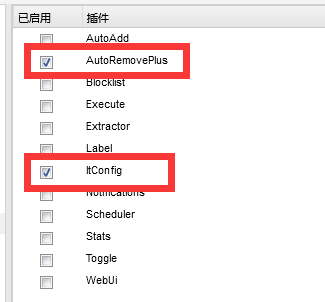
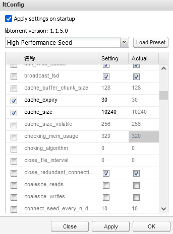
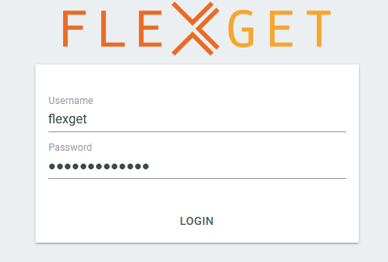
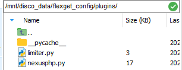

# 前言

之前发现墙上网口的带宽是千兆对等，心想岂不是可以用来刷pt？

于是开始研究pt圈子内部用的“盒子”配置

所谓“盒子/seedbox”，通常是指租的云服务器，具有以下特点

1. 大带宽，通常是上g
2. 有公网ip，并且大部分早被各大pt站标记为“盒子”
3. 用于下载各种pt资源，特别是刚出的热种，刷上传量

通常的pt站点内，账号的上传量是最重要的，不仅可以用来提高分享率，还能够提高账户的等级，等级高到一定程度就不会因长时间不登录而删号，达到俗称的“毕业”

博主手头上有个4t的洋垃圾机械硬盘，还有一个之前做项目留下的树莓派4b（2g），便咸鱼了一个垃圾硬盘盒和几根千兆线，打算自建一个低配版的“盒子”

# 正文

## 树莓派4b的系统初始化和硬盘的挂载

这部分详见以前的文章

## docker容器配置
本次盒子的配置采用deluge+flexget结合各种插件完成全自动刷上传的功能

以下所有操作，大硬盘均挂载于/mnt/disco_data下，仅供参考

### deluge

先上docker配置：
```
 docker run -d  \
  --name=deluge  \
  -e PUID=1000   \
  -e PGID=1000   \
  -e TZ=Asia/Shanghai   \
  -e DELUGE_LOGLEVEL=error `#optional`    \
  --net=host   \
  -v  /mnt/disco_data/pt_config:/config   \
  -v /mnt/disco_data/pt_download:/downloads   \
  --restart unless-stopped   \
  ghcr.io/linuxserver/deluge
```

进去后默认密码是`deluge`

修改默认下载目录：

打开deamon连接端口，接下来flexget会用这个进行交互

接着再在/mnt/disco_data/pt_config中新建plugins文件夹，把插件放进去


插件项目地址：
* [ltconfig](https://github.com/ratanakvlun/deluge-ltconfig)
* [autoremove](https://github.com/omaralvarez/deluge-autoremoveplus/files/3312651/AutoRemovePlus-0.6.2-py3.7.zip)
> autoremove这个插件好久没更新了，有老哥做了新版适配，并且给出了docker中的使用方法，这里是原讨论[链接](https://github.com/omaralvarez/deluge-autoremoveplus/issues/50#issuecomment-526851615)，所以下下来之后记得按照这个法子重命名一下

放好插件之后重启一下deluge容器，再进去应该就能看到插件了


#### ltconfig配置

ltconfig插件是用来优化上传速度的，如果是正常的大内存机器，可以直接使用（high performance seed）模式，由于博主只有个丐版树莓派，所以需要调教一下

个人感觉最重要的就两项：cache_expiry和cache_size

我的设置如下：

如果设置太大了，比如[这个博客](https://blog.acesheep.com/index.php/archives/622/),容易爆内存，导致deluge容器被杀掉，虽然docker会帮你自动重启，但这样又得重新开始链接，比较慢。

此时内核报错如下：`dmesg`


我还找到了一份专门给树莓派4b用的配置文件[链接](https://github.com/seedboxer/itconfigPI)

这份比较稳，适合当稳定的流媒体服务器使用，而我则是用来刷pt的，当然就应该在进程崩溃边缘反复横跳啦！

#### autoremove配置
[官方配置说明](https://github.com/omaralvarez/deluge-autoremoveplus)

我的配置：


解释：下完后，做种3天（防止hr，opencd，说的就是你！）

### flexget
docker配置：
```
docker run -d     \
 --name=flexget     \
 -p 5050:5050     \
 -v /mnt/disco_data/flexget_data:/data     \
 -v /mnt/disco_data/flexget_config:/config     \
 -e FG_WEBUI_PASSWD=AdminimdA?     \
 -e FG_LOG_LEVEL=info     \
 -e FG_LOG_FILE=flexget.log     \
 -e PUID=1000     \
 -e PGID=1000     \
 -e TZ=Asia/Shanghai     \
 wiserain/flexget
```
> FG_WEBUI_PASSWD这个设置你自己的密码，注意flexget默认需要很高强度的密码，如果启动失败，建议看一下启动的log，说不定就是说你的密码太弱了，不让启动……

启动完成之后，进入5050端口的网页，输入密码


成功之后，开始配置flexget的插件

同样在/mnt/disco_data/flexget_config中新建plugins文件夹，把插件放进去



插件地址：
* [flexget-nexusphp](https://github.com/Juszoe/flexget-nexusphp) 用于高级过滤（免费，2x这种）
* [flexget-limiter](https://github.com/Juszoe/flexget-limiter) 用于限制种子下载，在硬盘或者带宽顶不住的时候，停止rss订阅

#### flexget整体配置
因为插件加载后，全都在config中进行配置，这里我把自己的配置放出来，供读者借鉴，同时做个备份

```
web_server:
  bind: 0.0.0.0
  port: 5050
  web_ui: yes

templates:
   de:
    limit_new: 1
    limiter:
      wait: 10
      disk:
        write: 10240  # disk write speed KB/s
    content_size:
        min: 0
        max: 40960  #种子最大体积是40g
        strict: no
    deluge:
        host: 192.168.123.60 #填deluge的地址
        port: 58846
        username: localclient
        password: e3006f0f722e52949c1975c9b8a04c2874aa2a16   #这个看下面的解释
        path: /downloads

tasks:
  hdsky-task:
    rss:
      url: https://hdsky.me/torrentrss.php?rows=10&linktype=dl&passkey=xxxxxxxxxxxxxxxxxxxxxxxxxx
      other_fields:
        - link
    nexusphp:
      cookie: 'c_secure_uid=xxxxxxxxxxxxxxxxxxxxxxxxxxxxxx'
      discount:
        - free
        - 2xfree
      seeders:
        min: 1
        max: 3
      leechers:
        min: 5
        max_complete: 0.2
      user-agent: Mozilla/5.0 (Windows NT 10.0; Win64; x64; rv:92.0) Gecko/20100101 Firefox/92.0
  
    template: de
    
  ptertask:
    rss:
      url: https://pterclub.com/torrentrss.php?rows=10&linktype=dl&passkey=xxxxxxxxxxxxxxxxxxxxxxxx
      other_fields:
        - link
    nexusphp:
      cookie: 'c_secure_uid=xxxxxxxxxxxxxxxxxxxxx'
      discount:
        - free
        - 2xfree
      seeders:
        min: 1
        max: 3
      leechers:
        min: 5
        max_complete: 0.1
      user-agent: Mozilla/5.0 (Windows NT 10.0; Win64; x64; rv:92.0) Gecko/20100101 Firefox/92.0
    
    template: de
  
  
 
schedules:
  - tasks: hdsky-task
    interval:
      minutes: 10

  - tasks: ptertask
    interval:
      minutes: 10
```

deluge那里的密码在`"/mnt/disco_data/pt_config/auth"`这个文件里面

```
[root@alarmpi ~]# cat "/mnt/disco_data/pt_config/auth"
localclient:e3006f0f722e52949c1975c9b8a04c2874aa2a16:10
```
那么密码就是e3006f0f722e52949c1975c9b8a04c2874aa2a16


limiter配置选择硬盘写入作为判断，因为flexget和deluge处于不同的容器，网口不一样，flexget中读不到deluge的真实下载速度。我在flexget容器中写了个脚本，观测网络速度和硬盘写入速度，结果如下（单位都是M/s）：


明显有数量级的差距，只能用硬盘写入来判断了。

# QA
deluge可能有时web页面登录不上去了，总显示密码错误。这时候试一下密码为空，说不定就能进了。
> 触发原因：更新deluge配置时，火狐浏览器自动把空密码填到修改密码那一栏去了……然后就把密码改成了空

# 结尾
之前用过qbit、tr，结合好多其他的方式配置盒子，甚至自己写过爬虫，尝试过滤出免费种。

后来网上冲浪时发现早有大手子写过了，果然还是不要造轮子的好。

flexget很早之前就听过，但一直嫌麻烦，最近闲下来了摸一摸，没想到一天就摸出来个大概，比想象中的简单多了，真香

所以不要小看脚本小子啊！有脚本小子当然也有脚本老子，只要能达成目标，就是大手子！


