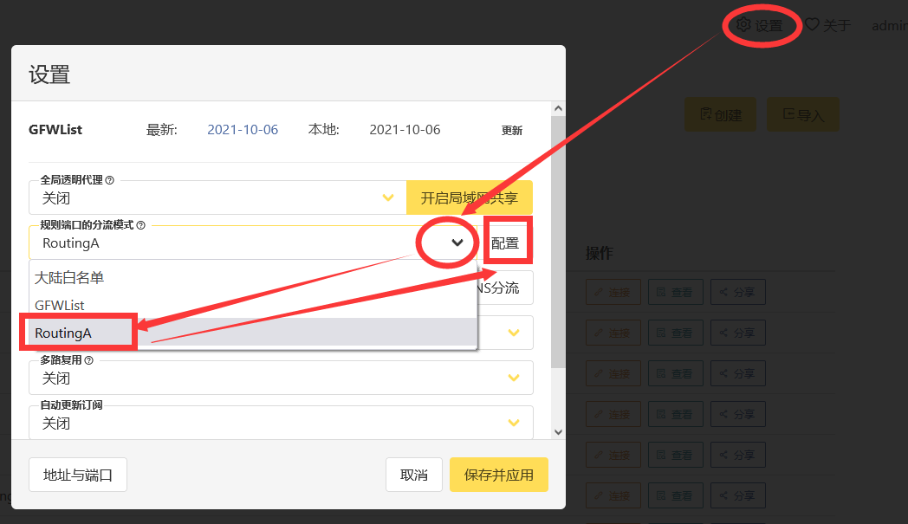
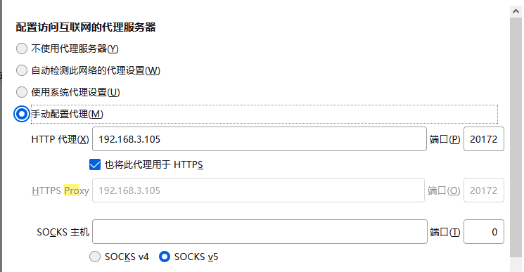

# 前言

虽然学校内的环境很美好，但免不了需要外地进行访问的问题

比如北邮人pt站，只能教育网ipv6访问。

但学校内部没有适合放硬盘的地方，因此需要一个中间机器进行转发。

这主要涉及到俩个方面：

* 校外如何访问校内的设备（vpn）
* 校内校外的设备如何进行设置，以达到分流的目的

这篇文章主要记录关于第二个问题，博主的解决办法

# 正文

硬件条件：

* 校内一台树莓派（archlinux）    记为A
* 校外一台linux系统的服务器（archlinux）  记为B
* 校外一台win10台式机 记为C

网络环境：

* A
  * 能够正常访问北邮人等教育网专用网站
  * 拥有ipv6与ipv4
* B和C
  * 能够通过ip直接访问A（vpn已架设好）
  * 只有ipv4
  * BC处于同一局域网下

## A的配置

全部通过docker进行，架设http代理，命令如下

```
docker run -d --name tinyproxy -p 8888:8888 -e "ALLOWED=0.0.0.0/0" ajoergensen/tinyproxy
```

## B的配置

全部通过docker进行，使用v2raya进行分流代理，命令如下

```
docker run -d \
  -p 2017:2017 \
  -p 20170-20180:20170-20180 \
  --restart=always \
  --name v2raya \
  -v /mnt/bignas/v2raya:/etc/v2raya \
  -e V2RAYA_V2RAY_BIN=/etc/v2raya/xray \
  mzz2017/v2raya
```

***注意***：原本的镜像没提供xray内核，需要先**自行下载xray**然后映射进去，同时给定环境变量，强制使用xray。  [v2raya说明文档](https://v2raya.org/docs/prologue/installation/docker/)

### v2raya web配置



进去之后配置，博主的配置如下，仅供参考

```
outbound:hust=http(address: 10.243.113.248, port: 8888)
default: proxy # 默认走代理

# pt站点
domain(domain: pt.keepfrds.com,domain: m-team.cc)->direct
domain(domain: hudbt.hust.edu.cn, domain: byr.pt)->hust

# 国内，本地
domain(geosite:cn)->direct
ip(geoip:private, geoip:cn)->direct

# 学术
domain(geosite:category-scholar-!cn, geosite:category-scholar-cn)->hust
```

这里的 10.243.113.248是A的vpn地址

这个分流规则非常强大，配置比较复杂，[教程](https://github.com/v2rayA/v2rayA/wiki/RoutingA)

## C的配置

以火狐浏览器为例



192.168.3.105是B的局域网地址

# 结尾

设置完成之后，能够正常访问北邮人等网站，兼具fq等功能。

# QA

vpn怎么搭建啊？

> 到网络中心去申请，校园网账号就行
