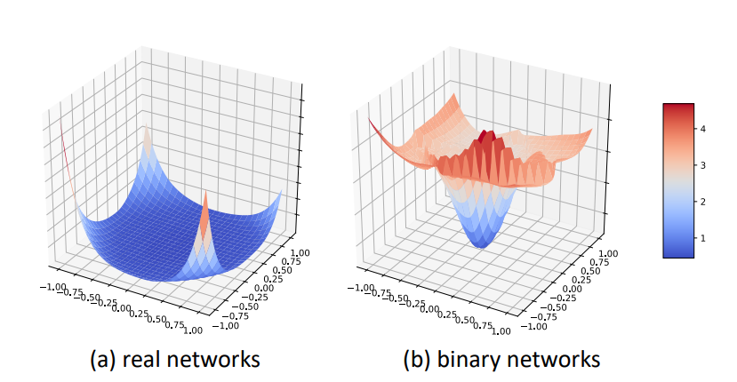
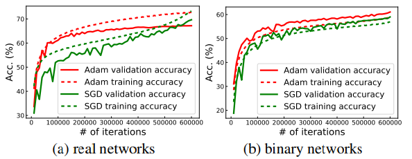
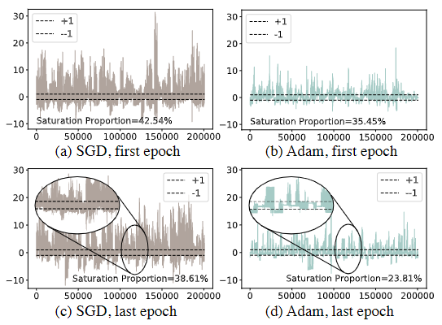
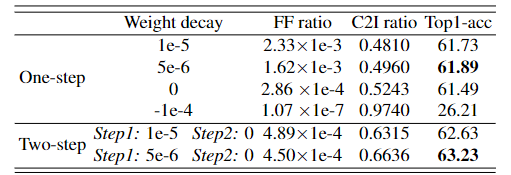
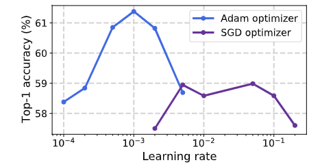

# Adam优化器是如何加速二值化神经网络训练的
# 前言

这是一篇ICML 2021的论文，比较新而且作者开源了相关代码。

由于毕设相关需要进行神经网络某一层的二值化，正好了解一下神经网络二值化相关的前沿研究现状。

于是选择这一篇进行翻译

原文链接：https://arxiv.org/pdf/2106.11309.pdf

代码链接：https://github.com/liuzechun/AdamBNN

> 一些废话就不翻译了……
> 试一下github-web直接写博客，markdown不好插图，就不放图了，这里的图n读者可以自己对应到原文图n去看
> 尽量会用博客的形式写，论文格式看的比较累……

# 正文

## 摘要

效果最好的一些关于二值化训练的文章用的都是adam优化器，但是据我们了解，很少有人去仔细研究其中的原理。

为了深入研究这其中发生了什么，我们首先研究了bnn在训练过程中的权重和梯度变化，我们发现了adam中的二阶动量能够将bnn中“死亡”的节点重新“盘活”。我们还发现 Adam 因为其自适应学习率策略，能够更好地处理 BNN 中凹凸不平的损失函数超平面，并以更好的泛化能力达到更好的最优解。

此外，我们还发现了二值神经网络中的“真实权重”在训练中的有趣作用，并揭示了权重衰减对 BNN 训练的稳定性和训练速度的影响。

通过大量的实验和分析，我们提出了一个简单的训练方案，建立在现有的基础 Adam 优化器之上，使用与 Sota ReActNe相同的架构在 ImageNet 数据集上实现了 70.5% 的 top-1 准确率，同时实现了比原文更高1.1% 的准确率。代码和模型可在 https://github.com/liuzechun/AdamBNN 获得。

## 1.简介

神经网络的优化是在一个超平面中寻找最小值，bnn由于其值选择的限制，导致bnn的超平面参差不齐，有很多局部最优值，如图一所示

*图一：具有相同架构 (ResNet-18) 的常规网络和二值网络的实际优化超平面。我们是按照 (Li et al., 2018) 中的方法来画的。*

很多人都发现了使用adam训练二值神经网络有奇效，但很少有人去研究其中的原因。

*图二：在 ImageNet 上训练的常规和二值网络（基于 ResNet-18）的 top-1 精度曲线。在常规网络上，SGD 在最后几次迭代中实现了更高的准确率和更好的泛化能力。因为二值化具有很强的正则化效应，导致其验证精度高于训练精度。在这种情况下，Adam 的表现优于 SGD*
   
Wilson et al. (Wilson et al.,2017) 等人最近的工作表明：像adam这种带有自适应学习率的优化器，比sgd这种动量型优化器要垃圾一些，具体表现在adam找到的最优点比sgd要少。这一结论与我们平常炼丹的经验相符，最近的一些机器视觉、自然语言处理等方向的文章用的都是sgd优化器。但从理论上来说，adam前期训练的收敛更快，最终的效果应该比sgd要好一些，这似乎不符合直觉。

我们发现在常规的网络中，往往会出现过度拟合的现象，如图二所示。但我们接下来发现，bnn不一定会发生这种情况，即使我们延长bnn的训练时间，还是会出现在训练集上欠拟合的情况。在图二b中，sgd优化器抖动的更加厉害，表明sgd可能很容易在bnn参差不齐的超平面中迷路，从而找不到最优点。

基于这些观察到的现象，我们研究了这其中的根本原因，在bnn的训练过程中，由于“激活饱和效应”，使得一部分节点梯度变为0。

如果用sgd优化器，sgd每轮更新的权重只跟当前的梯度有关，所以很难把那些已经“死”了的节点重新激活。用适当的梯度重新激活那些“死”节点，能够极大地提高bnn的训练效率。

我们的可视化结果和最终的实验结果进一步证明了这一结论。在我们的试验中，来自adam的二阶动量的历史效应能够有效的解决“死”节点的问题。

除了研究adam和sgd这类优化器之间的差别之外，我们还研究了bnn具体的训练策略对其的影响。以前许多人都提出过这类策略：

1. Yang (Yang et al., 2019) 提出将权重从 16 位逐步量化为 1 位。
2. zhuang (Zhuang et al., 2018) 提出首先对权重进行二值化，然后在第二步中对激活进行二值化。
3. 最近Martinez (Brais Martinez, 2020) 提出了一种两步策略，首先将激活二值化，然后将权重二值化。

> 这些策略的实现方式都很复杂，但基本都没告诉你为啥要这样设计……。

在我们工作的第二部分，我们没有提出新的训练策略，而是从一个重要但被忽视的角度解释 BNN 训练策略背后的机制——权重衰减。我们分别用两个指标：` FF 比率`和 `C2I 比率`来量化权重衰减对 BNN 优化的稳定性和初始化依赖性的影响。在这些指标的指导下，我们确定了一个更好的权重衰减方案，将最先进的 ReActNet 的准确率从 69.4% 提高到 70.5%，**超过了**之前发表的所有关于 BNN 的研究。

与之前专注于为 BNN 设计网络架构的研究不同，我们专注于优化器和训练策略的研究，我们觉得这样能够最大化的发掘现有网络结构的潜力。我们所有的实验都是在完整的 ImageNet1 上进行的，它更可靠。我们相信我们的探索性实验将有利于 BNNs 优化的研究，并可能在这个方向上激发更多有趣的想法。

### 贡献
总之，我们解决了以下问题，具体的研究贡献如下： 
* 我们在大规模 ImageNet 数据集上为 BNN 优化提供了不同优化器之间的彻底和公平的比较，尤其是 Adam 和 SGD 之间的比较。我们进一步设计了几个指标来分析二元行为背后的模式，并基于训练中梯度和权重的改变提出了一种简单的可视化方法。
* 我们可视化了训练的轨迹曲线，来解释为什么自适应学习率这个功能很重要，尤其是在优化超平面非常参差不齐的时候。最后得出结论，梯度归一化对于 BNN 的优化至关重要。 
* 我们进一步研究了各种关于BNN的优化策略设计，并对其中的权重衰减效应进行了深入分析。基于这些分析，我们提出了优化 BNN 的实用建议。这些结论帮助我们训练模型的准确率比之前的最新结果高 1.1%。

## 2.相关工作
二值神经网络优化的研究主要可以分为几个方面：

* 结构调整

以前改进 BNN 的尝试主要集中在网络结构设计上，包括添加实值跨链接 (Liu et al., 2018b;a; 2020) 或实值注意力模块 (Brais Martinez, 2020)，扩展通道宽度（Mishra 等人，2017 年；Zhuang 等人，2019 年），集成更多二值网络（Zhu 等人，2019 年）或使用循环卷积（Liu 等人，2019 年）。这些文章提出的结构能够有效地增加网络效果。在这项工作中，我们有动力消除与结构设计正交的二元优化过程。

* 梯度误差减少和损失函数设计 
  
一些研究关注减少 BNN 的梯度误差，例如，XNOR-Net (Rastegari et al., 2016) 使用实值缩放因子与二进制权重和激活相乘，以及ABC-Net (Lin et al., 2017) 采用了更多的权重基数。 IR-Net (Qin et al., 2020) 建议 Libra-PB 同时最小化量化误差和信息丢失。一些文章调整了损失函数。侯等人提出的损失感知二值化（Hou 等人，2016 年）使用近端牛顿算法和对角 Hessian 近似来直接最小化损失 w.r.t.二进制权重。丁等人。提议的激活正则化损失以改进 BNN 训练（Ding 等人，2019）。这些研究还旨在解决二元神经网络中离散性带来的优化挑战。相反，我们仔细研究了另一个重要但研究较少的角度，优化器和优化策略推理。

* 优化器选择和设计

最近，许多二元神经网络选择 Adam 而不是 SGD，包括 BNN（Courbariaux 等人，2016）、XNOR-Net（Rastegari 等人，2016）、Real-to-Binary Network(Brais Martinez, 2020)、Structured BNN (Zhuang et al., 2019)、ReActNet (Liu et al., 2020) 等。 Helwegen et al.提出了一种基于 Adam 的新二元优化器设计（Helwegen 等人，2019）。二元神经网络优化的实证研究（Alizadeh 等人，2018 年；Tang 等人，2017 年）也明确提到 Adam 优于 SGD 和其他优化方法。然而，Adam 适合二元网络优化的原因仍然知之甚少。在这项研究中，我们调查了 Adam 的行为，试图引起人们对二元优化器理解的关注，并在给定的网络结构内提高二元网络的性能，我们希望这对社区有价值。

* 训练策略

多项工作提出了不同的多步训练策略来提高 BNN 的性能。庄等人。 (Zhuang et al., 2018) 提出首先量化权重，然后量化权重和激活。以下（庄等人，2018），杨等人。 (Yang et al., 2019) 提出从较高位宽到较低位宽逐步量化权重和激活。最近的研究（Brais Martinez，2020 年；Liu 等人，2020 年）建议首先对激活进行二值化，然后在第二阶段进一步对权重进行二值化。之前的那些工作都提出了自己的训练技术，但很少将技术概括为背后的原因，这也给追随者在确定他们可以在自己的情况下使用哪种技术时带来了困惑。在这项工作中，除了提供可能的解决方案之外，我们还分析了选择优化策略的基础，希望能在该领域激发更多有趣的解决方案。

## 3.方法

本节首先介绍来自实值网络和二元神经网络 (BNN) 训练的几个观察结果。我们观察到 Adam 在 BNN 上的泛化能力优于 SGD，如图 2 所示。这种现象促使我们问为什么 SGD 对实值分类网络效果更好，但在二元神经网络优化中失去了优势。以此开始，我们在优化实际二元神经网络期间可视化激活饱和现象，并在第 3.2.1 节中考虑其对梯度大小的影响。然后我们观察到激活饱和会导致通道权重的不公平训练问题，如第 3.2.2 节所述。

此外，为了清楚地解释，我们构建了一个包含符号函数的假想二维损失图，以模拟第 3.2.3 节中激活二值化的 BNN 的简化优化过程，并且我们分析了 Adam 如何帮助克服零梯度局部最小值.此外，我们指出 BNN 中的实值权重可以视为置信度得分，如第 3.2.4 节所述，使 BNN 优化变得复杂。因此，我们在 3.3 节中定义了几个指标来描述 BNN 的属性并衡量 BNN 训练策略的优劣。最后，我们提供了优化 BNN 的实用建议。

### 3.1前言

二元神经网络优化具有挑战性，因为 BNN 的权重和激活是 {-1, +1} 中的离散值。特别是，在前向传递中，实值权重和激活值使用符号函数进行二值化。

请注意，实值激活 ar 是前一层的输出，由二进制或实值卷积运算生成。真实的权重wr在后端储存以累积小梯度。后端是指在前向传递计算中不使用权重。相反，实值潜在权重乘以通道方式的绝对平均值 ($\frac{1}{n}\left\|\right\|W_r\left\|\right\| _{l1}$) 的符号用于更新二进制权重（Rastegari 等人，2016 年）。

在反向传播中，由于符号函数的不可微特性，总是采用$clip(-1,a_r,1)$函数的导数作为符号函数导数的近似(Rastegari et al. , 2016)。值得注意的是，由于符号是一个范围有界的函数，当激活超过有效梯度范围([−1,1 ])，这会导致将在第 3.2.1 节中讨论的优化困难。

### 3.2 现象观察
#### 3.2.1 梯度的激活饱和度

*图3 来自 ImageNet 上不同优化器的二进制 ResNet-18 结构中的激活分布。虚线是上限 (+1) 和下限 (-1)。我们画了第一个二值卷积层的激活值的分布情况，我们观察到 SGD 和 Adam 优化器的 BNN 都有激活饱和的现象。然而，与 SGD 相比，Adam 可以在优化过程中缓解激活饱和，如 (c) 和 (d) 中的放大视图所示。我们进一步统计了 SGD 和 Adam 超出边界的激活次数，第一个 epoch 后的百分比分别为 42.54% 和 35.45%，最后一个 epoch 后的百分比分别为 38.61% 和 23.81%。 Adam 优化的激活饱和比例明显低于 SGD。更多详情请参阅第 3.2.1 节。*

根据符号函数的导数近似的定义（Ding et al., 2019），激活饱和是激活的绝对值超过1并且相应的梯度被抑制为零的现象。根据我们的观察，激活饱和存在于二元网络的每一层，它将严重影响不同通道中梯度的大小。在图 3 中，我们可视化了第一个二元卷积层的激活分布。我们可以观察到许多激活超过了 -1 和 +1 的边界，使得通过这些节点的梯度变为零值。根据链规则 (Ambrosio & Dal Maso, 1990)，梯度极易受到后层激活饱和的影响，因此会以相应的幅度剧烈振动

#### 3.2.2 权重训练过程中的公平性

不公平的训练是一些通道中的权重没有被优化来学习有意义的表示的现象。给定不同批次的图像，激活饱和通常发生在不同的激活通道上。在这些通道中，我们观察到的梯度总是很小，这会导致训练不公平。请注意，权重是指二元神经网络中的实值潜在权重。这些实值权重的大小被视为“惯性”（Helwegen 等人，2019 年），表明相应的二进制权重改变其符号的可能性有多大。

为了衡量不公平训练的影响，我们计算了 Channel-wise Absolute Mean (CAM) 以捕获内核中实值权重的平均幅度，在图 4 和图 5 中用红色字符表示。 CAM 的定义如下：

$$
CAM = \frac{1}{N_{in} \cdot k\cdot k } \sum_{c=1}^{N_{in}}\sum_{i=1}^{k}\sum_{j=1}^{k} | w{\{c,i,j\}} | \tag{3}
$$

其中$N_{in}$是输入通道的数量，$w$ 是 BNN 中的权重，c 是通道索引，i,j 是 c 通道中的元素位置，k 是内核大小。我们可以看到，当使用 SGD 时，二元网络中潜在权重的 CAM 值（图 4（b））与其实值对应物（图 4（a））相比较小，并且方差也较高，这反映了 SGD 优化二元网络内部的不平衡权重训练。

*图4 训练一个 epoch 后第一个二元卷积层中的权重值分布。为清楚起见，我们使用红色字符来标记每个内核中实值权重的 Channel-wise Absolute Mean (CAM)。灰色虚线表示 Adam 优化二元网络中权重的最小 CAM 值 (0.0306)。与 Adam 相比，SGD 优化导致更低的 CAM 值和更高的标准偏差 (SDAM)，这表明使用 SGD 优化的权重不如使用 Adam 优化的权重公平（训练有素）。更详细的分析见3.2.3节*

为了测量经过训练的潜在实值权重幅度的均匀性，我们提出了每个输出通道上实值权重幅度的绝对均值标准差 (SDAM)。 SGD 和 Adam 的 SDAM 统计数据如图 4 所示。 很明显，Adam 的 SDAM 低于 SGD，表明 Adam 训练的公平性和稳定性高于 SGD。

*图 5. 一个 epoch 训练后第一个二元卷积层中权重的更新值分布。为清楚起见，我们省略了原始更新值分布，并使用红色连字符标记每个内核中权重更新值的通道绝对均值 (CAM)。在这一层中，SGD 中 34.3% 的内核的 CAM 低于 Adam 中的最小 CAM。另见第 3.2.3 节。*

#### 3.2.3 为什么adam比sgd要好

为了更好地说明，我们绘制了一个具有两个节点的网络的二维损失表面，其中每个节点都包含一个对其输入进行二值化的符号函数。如图 6 (a) 所示，符号函数导致离散化的损失情况中几乎所有输入间隔的梯度都为零，使得在超平面中无法通过梯度下降进行优化。

*图 6. 用两个二元节点的总和构建的网络的损失平面可视化。 (a) 前向传递中二元网络的损失面，二值化函数 sign(x) 将景观离散化，(b) 使用 clip(-1, x, 1) 的导数逼近后实际优化的损失面sign(x) 的导数，(c) 使用 SGD 优化器和 Adam 优化器征服零梯度局部最小值的比较，(d) 实际优化轨迹的俯视图*

在文献中，总是采用$clip(-1,a_r,1)$函数的导数作为符号函数导数的近似。因此，计算梯度的实际超平面是多个线性函数拼接成的。在图 6 (b) 中，只有当两个输入都落在 [-1, 1] 的区间内时，二元激活的近似梯度才会在两个方向上保持其值，如图 6 (b) 中的斜线区域所示。在该区域之外，梯度向量要么仅在一个方向上有值，要么在两个方向上都包含零值，这就是所谓的平坦区域。

在实际的 BNN 优化过程中，激活值取决于输入图像，并且会因批次而异，很可能会超过 [-1, 1]。这种激活饱和效应反过来导致梯度消失问题。为了说明，在这个 2D 损失表面上，我们用灰色圆圈表示优化的起点。从相同的梯度序列开始，SGD 优化器根据定义计算第一个动量的更新值：$v_t = γv_{t−1} + g_t$，其中 $g_t$表示梯度，$v_t$ 表示权重更新的第一个动量。

Adam的权重更新函数为：$u_t = \frac{\hat{v_t}}{\sqrt{\hat{m}_t}+\epsilon}$, $\hat{v}_t$和$\hat{m}_t$分别表示梯度和平方梯度的指数移动平均值。

在平坦区域，用 $\hat{m}_t$ 跟踪梯度的方差，更新值 $u_t$ 被归一化以克服梯度值的差异。与仅累积第一个动量的 SGD 相比，自适应优化器 Adam 自然地利用第二个动量的累积来放大关于具有较小历史值的梯度的学习率。如图 6 (c) 和 (d) 所示，当 x 方向的梯度消失时，与 SGD 相比，Adam 在 x 方向的更新值中包含更高的比例。在我们的实验中，我们发现这个特性对于优化具有更粗糙表面和由于二值化导致的局部平坦区域的 BNN 至关重要。图 5 还显示了在训练实际 BNN 时使用 CAM 形式的每次迭代的更新值。它证实了使用 Adam 训练，更新值通常大于阈值，但使用 SGD，这些值非常接近于零。因此，与 SGD 相比，来自饱和的“死”权重更容易被 Adam 重新激活。

#### 3.2.4 真实权重的物理意义

Adam 在 BNN 方面的优势也体现在最终的准确性上。如图7(a)所示，Adam实现了61.49% 的 top-1 准确率，与图 7（b）中 SGD 的 58.98% 相比，在超参数和网络结构方面强加给两个实验的一致设置。此外，我们研究了最终模型的图 7 中的权重分布，并获得了一些有趣的发现。我们发现性能更好的模型的实值潜在权重通常出现三个峰值，一个接近于零，另外两个超过 -1 和 1。对于那些使用 SGD 优化不佳的模型，值权重仅包含一个以零为中心的峰值。

实值权重的物理意义表明相应的二进制权重可以将其符号（-1 或 +1）切换到相反方向的难易程度。如果实值权重接近中心边界（0），它们很容易通过梯度更新的几步下降或偏置到-1或+1，使整个网络不稳定。因此，正如 (Helwegen et al., 2019) 中所提到的，实值权重可以被视为二进制值的置信度为 -1 或 +1 并不牵强。从这个角度来看，Adam 学习的权重肯定比 SGD 学习的权重更有把握，这一致验证了 Adam 是用于二元神经网络的更好优化器的结论。

### 3.3 理解 BNN 优化的指标

鉴于 Adam 优于 SGD，我们进一步研究了这一发现并研究了 BNN 的训练策略。基于 BNN 优化依赖于梯度累积的实值权重及其损失计算符号的有趣事实，与实值网络相比，BNN 优化是难以处理的。因此，为了更好地揭示令人困惑的 BNN 训练的机制，我们提出了两个指标来描述训练过程，并进一步发现了添加在实值潜在权重上的权重衰减在控制二元权重训练方面起着不可忽视的作用。

#### 3.3.1 BNN 优化中的权重衰减

在实值神经网络中，权重衰减通常用于正则化实值权重，使其不会变得过大，从而防止过拟合并有助于提高泛化能力（Krogh & Hertz，1992）

然而，对于二元神经网络，权重衰减的影响并不那么直接。由于 BNN 中权重的绝对值被限制为 -1 和 +1，权重衰减不再有​​效防止二进制权重过大。此外，在二元神经网络中，权重衰减应用于实值潜在权重。回想一下，在第 3.2.4 节中，BNN 中实值权重的大小可以被视为相应二进制权重对其当前值的*置信度*。在这些实值权重上添加权重衰减实际上是在尝试衰减*置信度*分数。

从这个角度来看，权重衰减会导致二元网络优化在稳定性和权重初始化的依赖性之间陷入困境。由于权重衰减大，潜在权重的大小被正则化为小，使得相应的二进制权重对其符号“不太自信”，并且更容易频繁切换符号，即降低优化的稳定性.随着权重衰减更小甚至为零，潜在权重趋向于-1和+1，相应的二进制权重将更稳定地保持在当前状态。然而，这是一种权衡，因为需要更大的梯度来提升权重以切换其符号以克服“死”参数问题。也就是说，在权重衰减很小或为零的情况下，网络的性能将受到初始化的严重影响。

#### 3.3.2 量化指标

*图 7. 最终的权重分布。我们发现与 SGD 相比，Adam 具有更多的潜在实值权重和更大的绝对值。由于实值权重可以看作是对应的二进制权重在其当前符号上的置信度得分，因此 Adam 优化的二值网络比 SGD 对值更有信心，最终的准确率也更高。*

为了量化这两种影响（网络稳定性和初始化依赖性），我们引入了两个指标：用于测量优化稳定性的触发器（FF）比率，以及用于测量对初始化的依赖性的相关与初始化 (C2I) 比率。 FF 比率定义为：

其中 **IFF**是权重在迭代 t 更新后是否改变其符号的指标。 $N_{total}$ 是具有 L 个卷积层的网络中的权重总数。 FFratio 表示触发器的比率，即改变其符号的权重百分比。然后我们将 C2I 比率定义为：

其中 $I_{C2I}$ 是权重是否与其初始符号具有不同符号的指标，$C2I_{ratio}$ 表示最终权重的符号与初始值之间的相关性。

在这里，我们研究了不同重量衰减值的 FF 比和 C2I 比。从表1不难发现FF比与C2I比呈负相关。随着重量衰减的增加，FF比呈指数增加，而C2I比呈线性下降。这表明一些触发器对最终权重没有贡献，而只会损害训练稳定性。

*表 1. 不同权重衰减的 Adam 优化的 FF 比、C2I 比和 Top-1 精度。请注意，此表中的 FF 比率是总训练迭代的平均值。*

在这个实验中，我们发现使用 5e-6 的权重衰减产生最高的准确度。此外，我们发现特定的两步训练方案（Brais Martinez，2020 年；Liu 等人，2020 年）可以解决 FF 比和 C2I 比之间的负相关。

#### 3.3.3 实际训练的建议

从本质上讲，是否在实值潜在权重上添加权重衰减的困境源于二进制权重在值上是离散的这一事实。对于零附近的实值潜在权重，值的轻微变化可能会导致相应的二进制权重发生显着变化，从而使得鼓励实值潜在权重聚集在零附近变得相当棘手。

有趣的是，我们发现最近的两步训练算法（Brais Martinez，2020 年；Liu 等人，2020 年）的一个很好的权重衰减方案可以解决这个难题。在 Step1 中，只对激活进行二值化，并使用权重衰减的实值权重来累积小的更新值。由于实值网络不必担心 FF 比率，我们可以简单地添加权重衰减来获得低初始化依赖性的好处。然后，在步骤 2 中，我们用来自步骤 1 的权重初始化二元网络中的潜在真实权重，并对它们强制权重衰减为 0。通过此操作，我们可以降低 FF 比率以提高稳定性并利用来自 Step1（类似于预训练）的良好初始化而不是随机参数。在这个阶段，高 C2I 比率不会损害优化。从这个角度来看，我们发现 5e-6 作为权重衰减在权重大小平衡方面表现最好，以便在 Step2 中进行良好的初始化

如图 7(c) 所示，两步训练中更多的实值权重倾向于聚集在 -1 和 +1 附近，表明这种策略比一步更有信心。通过查看早期时期的 FF 比率，简单地消除不需要的权重衰减值，我们可以找到具有较少试验和错误的良好权重衰减。我们将在第 4 节中看到，我们的训练策略在相同架构下的性能比最先进的 ReActNet 高 1.1%。

## 4 各种实验

这里就不翻译了

#### 4.3.2 两步训练

为了确保选择建议的两步训练算法的可信度，我们在不同的训练方案之间进行了受控比较。在表 4 中，我们建议的首先对激活进行二值化，然后对权重（BABW）进行二值化的顺序比反向的准确度高 2.93%。

在 BWBA 中，两个步骤都采用二进制权重，它们被限制为离散的。因此，与 BABW 的 Step1 中的实值权重相比，BWBA 的 Step1 中的二进制权重更难为 Step2 提供良好的初始化。因此BWBA无法达到打破FF比与C2I比负相关的效果。

    图 8. Adam 和 SGD 上的准确率与初始学习率

# 结尾

本文主要聚焦于二值网络的训练过程

* 首先用例子表明了为什么二值化网络难以训练

* 然后结合网络训练时候的内部权重变化趋势，提出了一个模型来解释为什么会这样

* 最后用这个模型解释了adam优化好的原因

* 还提出了一个针对二值网络训练的具体训练策略：二步训练

接下来可以结合作者开源的代码尝试迁移，感谢作者的工作！

