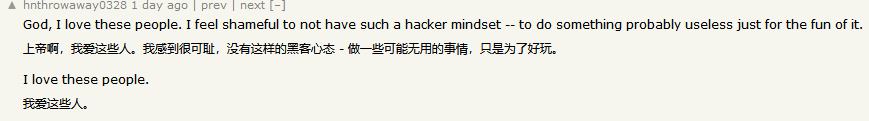

+++
title = "折腾dns"
description = "生命在于折腾"
date = 2024-05-09
updated = 2024-05-09
draft = false

[taxonomies]
tags = ["路由器","生活","翻墙"]

[extra]
math = true
math_auto_render = true
keywords = "路由器"
toc = true
+++

# 正文

受不了某地的网络环境了，又是dns污染，又是截流审查。

今天花了一整天研究了下dns分流和vray的流程机制

参考博客:

[漫谈各种黑科技式 DNS 技术在代理环境中的应用](https://tachyondevel.medium.com/%E6%BC%AB%E8%B0%88%E5%90%84%E7%A7%8D%E9%BB%91%E7%A7%91%E6%8A%80%E5%BC%8F-dns-%E6%8A%80%E6%9C%AF%E5%9C%A8%E4%BB%A3%E7%90%86%E7%8E%AF%E5%A2%83%E4%B8%AD%E7%9A%84%E5%BA%94%E7%94%A8-62c50e58cbd0)

[dns-处理流程](https://www.v2fly.org/config/dns.html#dns-%E5%A4%84%E7%90%86%E6%B5%81%E7%A8%8B)

文章写的很详细，适合小白

现在的架构是adguard+vray，vray通过useip和domainStrategy转发到adguard中，adguard再通过doh进行dns查询，这样能绕过很多奇怪的东西……

reality协议中偷证书的对象改成了zhihu，毕竟国内转发也要防一手，小心驶得万年船

# 后文

日常闲逛hackernews的时候，[发现了这篇帖子](https://news.ycombinator.com/item?id=40284291)

内容很有趣，国外老哥把nes玩出花了，通过在俄罗斯方块游戏的结尾写名称的输入方式触发栈溢出，获取整个nes的内存修改权限。理论上能够魔改出doom……

里面一个评论很触动我：

赛里斯这个地区从文化和根基上天然的对这种“好玩”的行为进行打击。

从这种文化背景培养出来的“人”，很难理解这种“无用”的行为。

就像老黄在采访中说的：“我妈总问我为什么不去干点正事”

唯生产力论真是毒瘤……

指望“有形的大手”来指导一切社会的发展未免太过傲慢了

我们总是高估自己的能力：人类最大的缺点就是无法想象自己没见过的东西，换句话说就是只会“内插”，很难“外推”

某种意义上人脑和现在的神经网络模型也挺像的，看来agi还很遥远……

