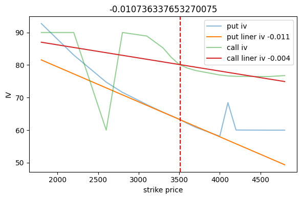
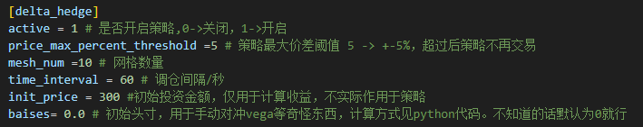
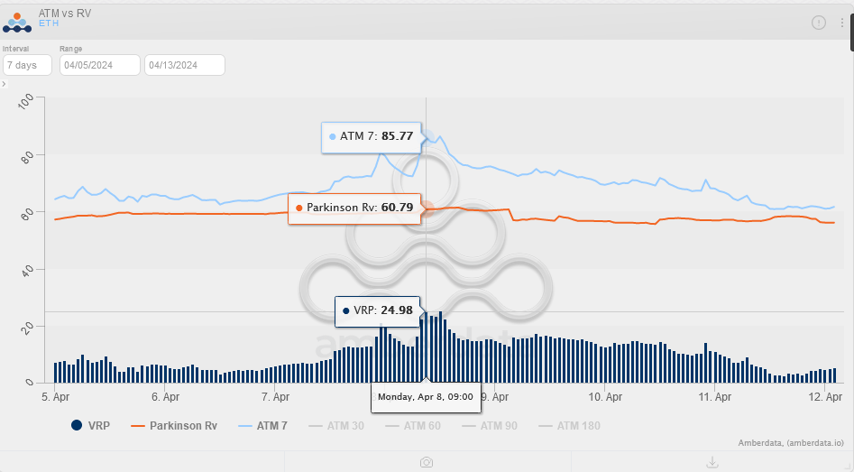
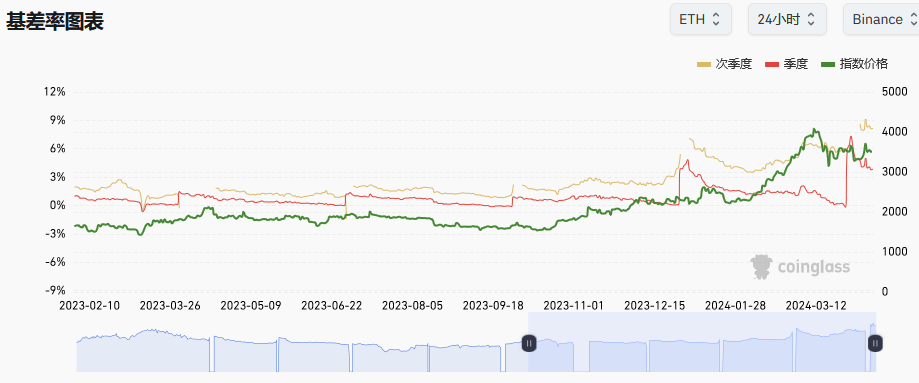
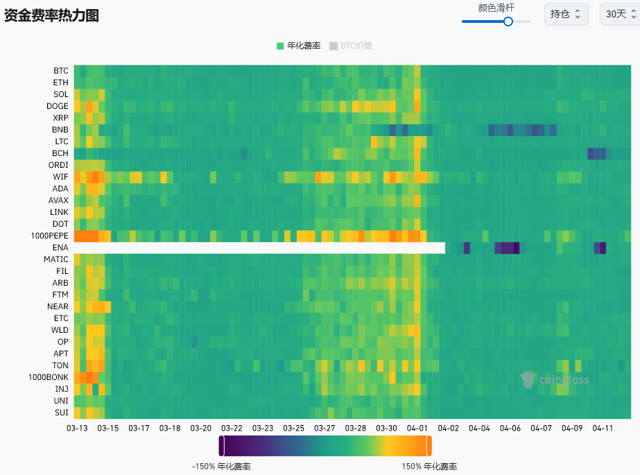

+++
title = "期权交易日志-1"
description = "挨打……"
date = 2024-04-12
updated = 2024-04-12
draft = false

[taxonomies]
tags = ["交易","期权","加密货币"]

[extra]
math = true
math_auto_render = true
keywords = "交易"
toc = true
+++

# 近期的一次交易教训

最近一直在玩加密的期权，由于资金小，只能做买方……

买方很蛋疼的一点就是胜率很低，期权的本质是在交易波动率，卖方天然的就有溢价，所以当买方进场就得交1-2个点的入场费。

## 当前的策略

1. 买隔两个月的稍微实值一到两个档的期权（theta损耗小），一个月内换仓或者平仓。
2. 在区间内进行delta对冲（+-10%），赚点gamma收益减少theta损失，并赌行情突破区间，突破后择时止盈。
3. 盈利内容包含：delta对冲的gamma收益，行情突破的收益(delta与vega)。

## 存在的问题

1. 这个策略非常依赖择时进入和退出（买方好像都这样……）
2. delta对冲时需要考虑波动率偏斜、对冲标的物本身的变化（永续的费率，交割的升贴水）

## 交易复盘

交易所是某安，标的是eth，购入的日期为24-4-1，行权日期为24-5-31

当时的波动率偏斜很离谱，市场处于牛市前期，所以斜率非常陡，24-5-31的波动率如图：

call的溢价太多了，根本买不起；因为我的策略是无方向的，所以就买了atm的put，再用远期的交割进行对冲。

结果第二天就开始狂跌，本来应该开心，但是发现总的账户价值并没有增加，反而在减少，当前（4-12）已经少了10%左右……

## 原因思考

经过多天的思考，以下是此次失败的教训总结

1. delta对冲程序运行正常。
2. 期权的波动率偏斜过大，导致标的物价格下跌时期权的iv下降，从而导致亏损。

> 损失值：4*3≈12

3. 标的物选择的是远期交割，由于价格下跌、远期交割刚刷新出来，导致升水陡然下降，从而导致亏损。

> 损失值：700*(15%-8%)≈50

4. rv与iv的差值(VRP)，择时出错，已经快半个月了并没有出现行情突破，并且整体IV都在下降，导致亏损。

> 损失值：4*4≈16

整体损失70刀左右，账户价值下降10%。

## 未来的改进

1. 出现波动率偏斜时，有俩种改进方式：

   1. 同时卖出远虚值的call期权，这种方式最好，能够减少theta与偏斜的负收益，但是由于资金小，不太适用，以后可能会采用。
   
   2. 计算当前的波动率偏斜斜率，写进程序，对冲掉这部分（已经完成）

      

2. 对冲标的物的选择

   1. 双买策略，买一份call就行。但是会承担双倍的theta/vega损失，更需要择时了，在没有波动率偏斜的时候，这种策略更好。
   
   2. 看情况选择远期或者永续，远期的升水降低了对冲的效果，但是永续的费率也会导致亏损，需要根据市场情况选择（年化指标）。
   
3. 择时

   1. vrp

      

   > vrp https://pro.amberdata.io/options/deribit/eth/current/

   2. 基差、费率

      

      

   > 基差：https://www.coinglass.com/zh/Basis
   > 费率：https://www.coinglass.com/zh/FundingRate
   > 年化：自己算！

## 总结

这次是在波动率下降的半山腰接盘了，不应该一次全梭哈，分批入场，减少择时的风险。

需要看更多的数据，不要只看iv，还要看vrp、基差、费率等等。

Life is a long gamma

