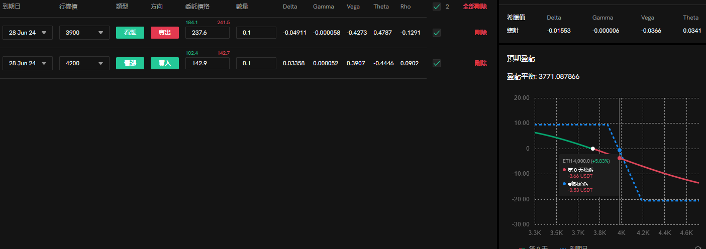

+++
title = "期权交易日志-5-30"
description = "要耐心"
date = 2024-05-30
updated = 2024-05-30
draft = false

[taxonomies]
tags = ["交易","期权","加密货币"]

[extra]
math = true
math_auto_render = true
keywords = "交易"
toc = true
+++

# 前言

玩期权的阵地转移到了coincall上，这是u本位的交易所，并且没有卖的最低资金量限制，eth最小交易的数量是0.1，还挺舒服，小散终于可以当卖家了

# 正文

能当卖家之后，可以用的“武器”更多了，打算先从牛熊价差做起，光是牛熊价差就有4种：

1. 牛市看涨
2. 牛市看跌
3. 熊市看涨
4. 熊市看跌

每种价差策略根据'行权点的分布'不同又有3种组合：

1. 保护型
2. 均衡型
3. 进攻型

所以一共是：$4\times3 = 12$种功能各异的“武器”

能把这12种武器玩溜耍应该就出新手村了

后续会写一写个人的经验

## 近期盘面情况

二饼在5.21冲上3600后就一直横盘，没冲上4000的前高

这段时间有几个值得关注的新闻：

1. 二饼的etf通过
2. 门头沟钱包异动
3. 纳指小涨后横盘（英伟达冲上1000，准备6.7号1拆10）

整体的波动率比较诡异

这十几天rv很小，iv冲高后被压的很低

近几天（27号左右），二饼的永续资金费率突然涨到了年化23%，多头有压力了。

感觉和2月份左右比较相似，估计30天左右（7-8月份）就会出现大趋势（希望是大牛）

从波动率曲面上来看也是一样，近期的倾斜偏向看跌，到7、8月份才出现翻转。

## 盘面总结

近月的支撑点评估：
* 高点：4000
* 低点：3000

近月的iv：看跌

> 在马赛克市场，iv不叫恐惧指数，而叫贪婪指数，因此iv大部分时间跟着市场一起涨跌，而不是和美股一样反着来

## 策略总结

因此目前的入场策略如下（上桌玩把大的！）：

1. 保护性牛市看跌（用call做看跌价差）
2. 时间选近月（1个月内）

示例如下：

策略说明：
1. 涨到4000才开始亏钱
2. 其余时间赚theta、空vega
3. 不一把全梭哈进场，开场只进一半、1/4仓，留手备牌后面接着打
4. 保护性牛市看跌的入场成本较低（都是虚值call），适合敏感肌

## 策略后续分析

#### 小波震荡、阴跌

赚点零花钱，没什么说的 

#### 小涨

不过4000就不亏，顶多亏点手续费

#### 暴涨

这个策略我们没进全仓，亏损是有限的，涨上去后再看情况分析。

4000上面就真的是无人区了，谁也不知道会发生什么，但我相信没人会讨厌一个狂暴大牛市。

#### 暴跌、大幅震荡

这种情况要着重说明一下，由于当前策略是用call做的，在方向对的情况下可以用手上的筹码一路埋核弹，将普通的价差策略转换为比例价差，用最小的成本赌最大的gamma核弹。

以前文的图为例，假如二饼掉到了3400，手上3900的short call就可以看情况提前平掉了，留下个非常虚的4200的long call当埋下的核弹

然后再开个牛市看跌接着重复上述的策略过程，不过这时候除了刚开的价差外，你还有个很低成本的核弹

只要上面策略重复的次数越多，埋下的核弹就越多，核弹保养的成本也越低；二饼一路跌你就一路埋，等一个超级大牛市把所有人都炸上天！

# 结语

上面的策略我还没试过，纯纯脑补，亏钱就当口嗨算了，哈哈哈