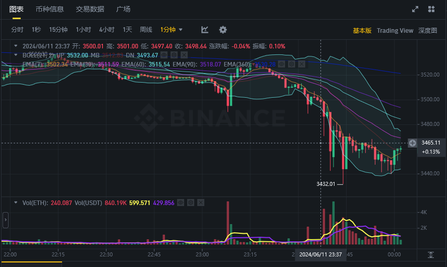
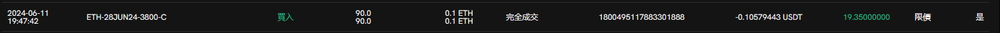
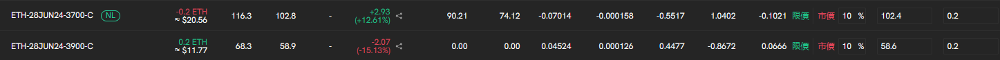
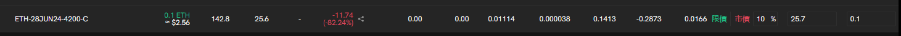
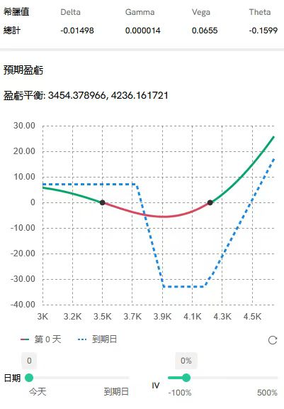
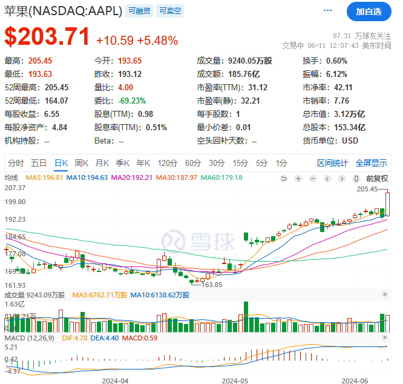
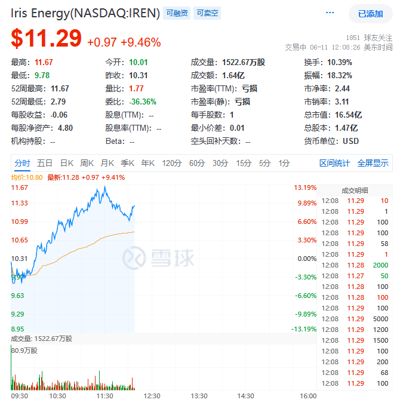
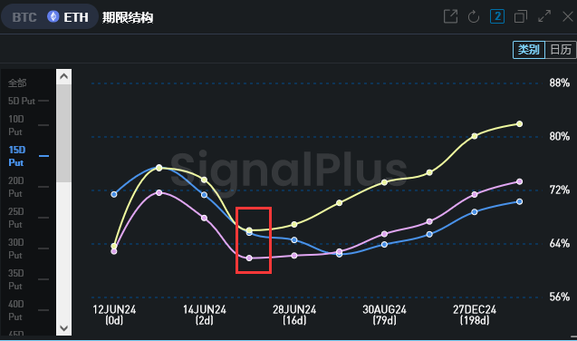
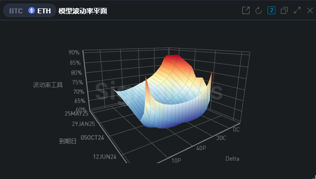

+++
title = "期权交易日志-6-11"
description = "我做对了吗？"
date = 2024-06-11
updated = 2024-06-11
draft = false

[taxonomies]
tags = ["交易","期权","加密货币"]

[extra]
math = true
math_auto_render = true
keywords = "交易"
toc = true
+++

# 前言

现在马赛克市场正在（如期）瀑布中

赶紧记录一下操作过程，以供日后分析

# 操作回顾

和之前的策略一样，将short腿止盈了：

然后接着开仓，继续保护性看跌（牛市看跌）：

因为只平了short腿，还有个call一直拿着：

这个腿带一点点theta衰减和delta，只能当彩票了，但是未实现盈亏里面还是个负的，不好看，所以这次开的仓数量就到0.2个了，想着最好能多赚点theta的钱，因此现在的仓位变成了奇怪的比例价差：

# 行情分析

## 美股

美股在大涨，苹果宣布与openai合作后股价破新高了

果然ai才是第一生产力！

我在想openai既然没上市，wld目前来看又那么拉跨，是不是买点苹果来作为openai投资比较好。

因此决定这个月工资梭哈果子了！

还有之前买的矿股也涨疯了，后悔买少了……

iris这个公司感觉从矿场转型为数据中心了，因此没有受到马赛克行情的影响，一路狂奔中

简直是我心目中的最佳标的，又是大饼、又是ai算力、又有廉价能源，退可挖矿养老，进可梭哈ai。

看来也得加点仓，哈哈哈哈。

## 马赛克

可能是美股涨势太好，把一些流动性吸走了。

很久之前熊市时也有过这样的情况，美股开盘一涨，马赛克就跌，但马赛克的宏观走势又和tqqq差不多，看不懂了……

看着跌了这么多，实际上还没到腰斩的地步，经历过519的老韭菜应该都还情绪稳定吧

说了这么多，还是日常技术面分析一下：

1. 首先是套利数据：

>{"ETHUSDT_240628":10.316517632435955,"ETHUSDT_240927":11.864166876064191,"ETHUSDT_PERP":10.950000000000001}

永续的年化没怎么变，交割的升水掉了挺多，从14掉到10左右了，套利的老哥们这波应该吃的挺爽

二饼掉了快10个点，永续的费率却没怎么降，说明很多老哥都在接针，大伙、散户们的共识还是很强大的：

>牛市必然会来，现在区区10个点，一点不够看的，越跌老子越兴奋，越跌老子越买！

毕竟孙哥的eth成本也在3000左右啊，什么事件要是能够把孙哥也割了，说实话，我也挺好奇的。

2. IV方面

还是老朋友：signalplus上看看

近期的iv砸的挺深的，都快到50多了

看看这远端的偏斜率，近端的偏看跌，远端看涨已经起飞了

说明一下，这里delta坐标是相对当前的价格偏离，说明大伙远端的call根本没怎么抛售，甚至还在加仓

从坐标轴上来看的化，就在7月份左右，大的估计快来了，大伙记得系好安全带

综上：个人分析，本次马赛克市场的（爆）跌只是短期的，估计是明晚的美国cpi数据公布，大伙可能短期避险，导致抛售，从而价格下跌。

因此还是选择进攻性看涨和保护性看跌的搭配组合

希望这次能够赚波大的

# 后记

这次止盈short腿不知道做的对不对，前面的策略过程以及构造的很好了，就是一些细节问题还没弄清楚，比如什么时候止盈、埋核弹/换仓的时候应该选择什么点位。

这些细节知识只能靠自己慢慢摸出来了，与全局最优之间的差距就靠学费来弥补吧。

这次止盈就有点没做好，应该等企稳的时候再换仓，这次换仓换早了，导致少赚了1刀左右，并且还亏了一些手续费，下次需要注意一下。