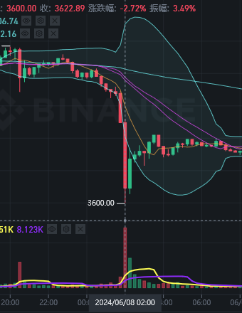
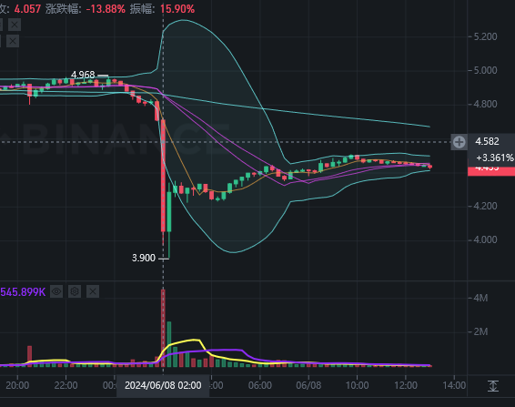
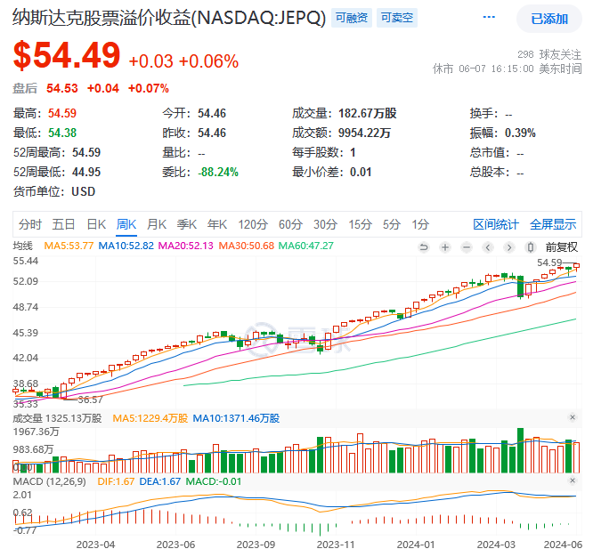
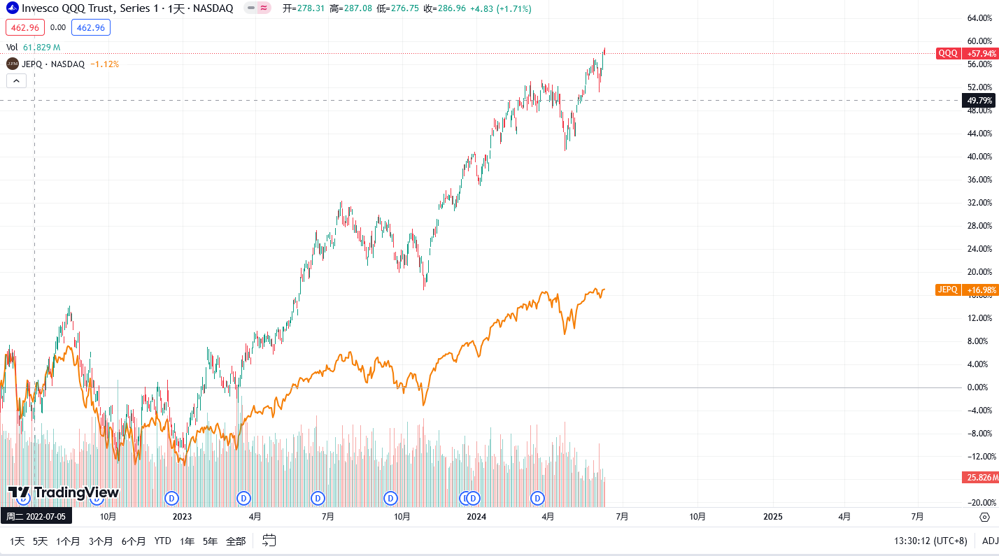
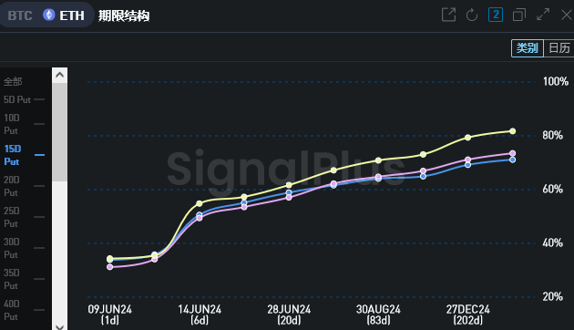
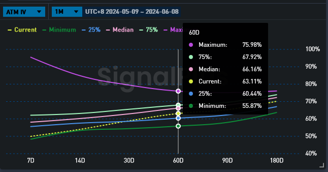
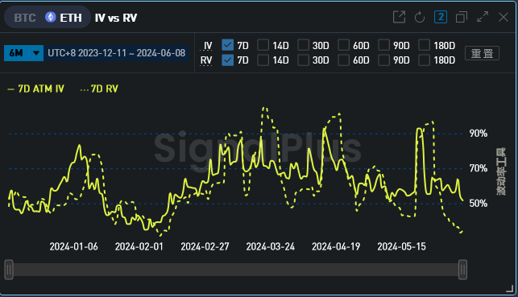

+++
title = "期权交易日志-6-8"
description = "不要手贱"
date = 2024-06-08
updated = 2024-06-08
draft = false

[taxonomies]
tags = ["交易","期权","加密货币"]

[extra]
math = true
math_auto_render = true
keywords = "交易"
toc = true
+++

# 前言

signal plus能对接币安了，但是散户还是不能做卖权，比较尴尬……

昨晚一波小瀑布，大饼二饼没怎么跌：

山寨死光了（wld）：

正规军入场后，马赛克市场的马太效应估计会越来越明显，山寨的资金都会被大头吸走，流动性减少，大家都没得玩了

昨天白天研究了一下期权的书，用永续和call合成了一个卖put，理论上在币本位中，行情不变或者下跌都是可以屯币的，coincall是u本位，下跌的过程中能看到永续的爆仓点还是在不断降低的，理论上确实是在屯币。

用现货和卖call合成的等效卖put这个策略叫做cover call，又称为备兑，美股中已经有成熟的etf帮你做这个操作了，例如jepq：

这种etf的分红很高，年化有15左右，基本上都来自于卖call的钱，对需要现金流的赌狗来说比较友好。

covercall的优劣从jepq和qqq的对比中就能明显看出来了：

横盘和下跌的时候，cover call策略可以吃到卖call的钱，增强收益，降低回撤

但在趋势行情中，长期来看，卖call就损失了向上突破的机会成本，跑不赢长牛：人类历史的发展

在内卷、科技被锁死、无限内耗的地区，这种策略就非常适合了（哈哈哈）

# 行情分析

昨晚一小波下跌，之前部署的策略是赚的（近月保护牛市看跌），看来4000这个点没这么容易突破上去。

这波下跌说是美国非农数据不利：美国就业形势强劲，可能降息还要暂缓。

不得不说美联储真会骗炮

不过这样也好，说明这波ai浪潮是泡沫的几率又减少几分，完全可以继续定投增加ai和算力中心的投入，争取吃满时代赠与的beta。

**说回正题**

首先还是分析版面情况分析：

费率方面：今天（6.8）二饼费率正常，非常健康

>{"ETHUSDT_240628":12.548113463626457,"ETHUSDT_240927":14.653590887304249,"ETHUSDT_PERP":10.950000000000001}

IV方面：昨晚的一波下跌把iv带崩了

星期的iv到30多了……甚至感觉回到了去年的熊市

远端的iv也有中程度的下跌，但还没破25%的点，说明大伙对远期还是有信心的

看看这rv，真的到去年熊市的点位了

## 接下来该怎么办？

现在做近期的卖权，主吃theta的策略肯定不行了，iv太低，没多少利润，还有gamma核弹的风险

从iv角度来说，现在绝对是做中远期双买策略的好时候，基本上没可能也没道理继续下跌了，再横盘小震荡下去流动性都快g了

那应该怎么办呢？

仓位中价差的利润还没有过半，现在就换仓埋核弹有点操之过急

因此打算这样安排接下来的策略：

1. 小跌、小涨、横盘（3500-3800）

不动，装死，接着打游戏，等到仓位的利润到60%~80%再考虑接下来的事情

2. 暴跌、大幅震荡

等到仓位中short腿的利润到60%~80%后平掉，准备换仓埋核弹

3. 暴涨（过4000）

老样子：没人讨厌一个超级大牛市

# 结语

今早起来发现亏了十几刀，都是学covercall干的好事，想了一会平掉永续的仓了，covercall这种摆烂养老策略是给大体量的矿老板和富二代玩的，咱们这种黄袍加身的穷逼赌狗老老实实分析行情吧。