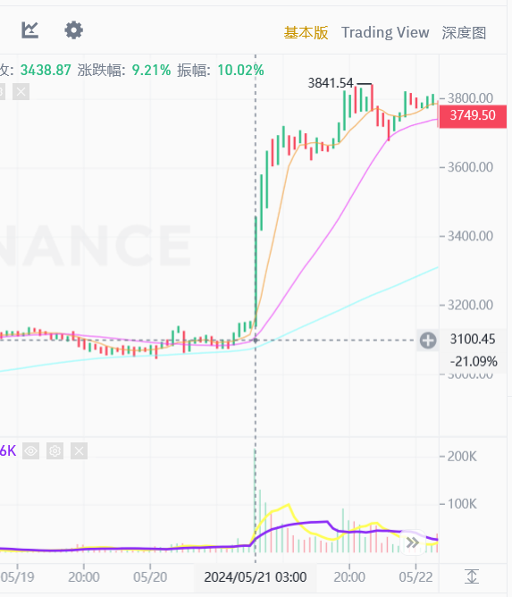

+++
title = "牛回，速归！"
description = "BTC幂律应验了吗？"
date = 2024-05-23
updated = 2024-05-23
draft = false

[taxonomies]
tags = ["交易","美股","加密货币","挖矿"]

[extra]
math = true
math_auto_render = true
keywords = "交易"
toc = true
+++

# 马赛克

（开局一张图）

前几天eth etf要通过的消息出了，导致二饼直接拉升20个点，到了4k左右晃荡。

> 孙哥还是你孙哥，提前大半个月做局买买买，眼光真的毒。你可以质疑孙割的人品，但你不能质疑孙割的眼光。

二饼拉起来后，大饼也拉回到了7w，eth/btc还有一波上涨的空间，之前二饼汇率一直在下降，这次不知道能不能回去。

## 山寨

当前重仓的除了大饼二饼，还有sol与wld。

sol的问题在于对矿机的要求太高了，散户没法入局，有些中心化；

wld的问题更大，公司内部派系斗争、人员调动非常频繁，wld又存在解锁带来的抛压，这波上涨并没有跟上，价格还在4左右。

个人打算等gpt5发布后再看情况，在高点分批跑掉算了。

# 美股

在盈透开户后才发现美股的选择这么多，不愧是全球最大的线上赌场，各种标的、杠杆……我已经来不及亏钱了！

## 长持

当前主要的策略还是qqq与tlt平衡+定投，这几个etf费率只有千2，甚至还有股息分红，爽！

越南的etf不仅费率高，溢价也高，还没有分红，吃人不吐骨头。

## 其他

余额还有2.5k刀

某安的出金比较困难，看看美股里有没有好的马赛克标的，往后外界对马赛克越来越接纳，券商里肯定更方便出入金。

btc etf只能美国用户买，越南的身份证还买不了，只能在雪球等韭菜论坛里逛街，看看大佬是怎么操作的。调研结果如下：

1. mstr是个好标的，基本上就是2xbtc，但目前的溢价太高了，现在上车怕翻车，等市场冷静一些再调仓过去吧。
2. coinbase是交易所，存在etf、uni等其他竞争的压力，暂时看不清楚后续的发展，不考虑。

再就是各种矿股了（没想到吧，不用买矿机就能当矿老板！）

矿股还挺多的，现在买了点iris，雪球上的分析说爱丽丝的发展前景不错，有地和能源，未来可能转型为算力中心，类似于ai+大饼的结合产业了。

英伟达财报中说要在6.7进行拆股，直接拉了10个多点，破了1000的大关，现在供给根本满足不了需求，股价看到1200刀，也就是说还有20的上涨空间。

忍不了，梭了2股，现在兜里没子弹了……